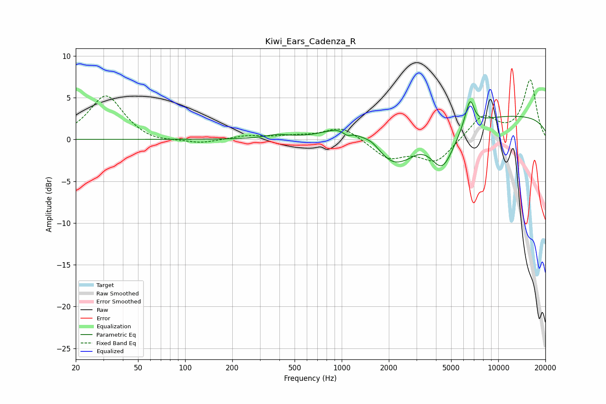

# Kiwi_Ears_Cadenza_R
See [usage instructions](https://github.com/jaakkopasanen/AutoEq#usage) for more options and info.

### Parametric EQs
Apply preamp of -4.6 dB when using parametric equalizer.

|   # | Type    |   Fc (Hz) |    Q |   Gain (dB) |
|-----|---------|-----------|------|-------------|
|   1 | Peaking |       387 | 1.91 |         0.4 |
|   2 | Peaking |      1005 | 1.3  |         1.4 |
|   3 | Peaking |      1081 | 4.9  |        -0.6 |
|   4 | Peaking |      1557 | 2.86 |         0.6 |
|   5 | Peaking |      2154 | 1.26 |        -3.8 |
|   6 | Peaking |      2695 | 2.71 |        -0.4 |
|   7 | Peaking |      4398 | 1.78 |        -5   |
|   8 | Peaking |      6172 | 4.94 |         0.5 |
|   9 | Peaking |      6625 | 5.23 |         3   |
|  10 | Peaking |     10000 | 0.18 |         3   |

### Fixed Band EQs
When using fixed band (also called graphic) equalizer, apply preamp of **-7.2 dB** (if available) and set gains manually with these parameters.

|   # | Type    |   Fc (Hz) |    Q |   Gain (dB) |
|-----|---------|-----------|------|-------------|
|   1 | Peaking |        31 | 1.41 |         5.3 |
|   2 | Peaking |        62 | 1.41 |        -0.5 |
|   3 | Peaking |       125 | 1.41 |        -0.5 |
|   4 | Peaking |       250 | 1.41 |         0.4 |
|   5 | Peaking |       500 | 1.41 |         0.3 |
|   6 | Peaking |      1000 | 1.41 |         1.6 |
|   7 | Peaking |      2000 | 1.41 |        -2.2 |
|   8 | Peaking |      4000 | 1.41 |        -2.7 |
|   9 | Peaking |      8000 | 1.41 |         2.8 |
|  10 | Peaking |     16000 | 1.41 |         7   |

### Graphs

