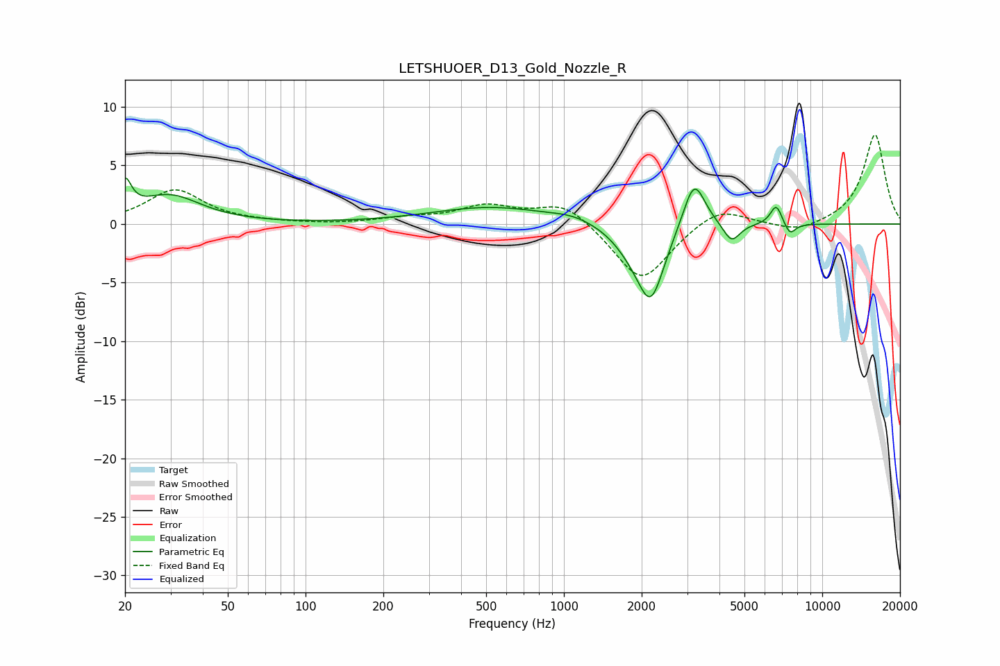

# LETSHUOER_D13_Gold_Nozzle_R
See [usage instructions](https://github.com/jaakkopasanen/AutoEq#usage) for more options and info.

### Parametric EQs
Apply preamp of -4.0 dB when using parametric equalizer.

|   # | Type    |   Fc (Hz) |    Q |   Gain (dB) |
|-----|---------|-----------|------|-------------|
|   1 | Peaking |        20 | 5.9  |         2.7 |
|   2 | Peaking |        30 | 1.17 |         2.4 |
|   3 | Peaking |       523 | 0.61 |         1.4 |
|   4 | Peaking |      1086 | 1.75 |         0.4 |
|   5 | Peaking |      1835 | 1.94 |        -1.4 |
|   6 | Peaking |      2171 | 2.66 |        -6   |
|   7 | Peaking |      3191 | 3.29 |         4.3 |
|   8 | Peaking |      4456 | 4.39 |        -1.6 |
|   9 | Peaking |      6641 | 5.94 |         1.8 |
|  10 | Peaking |      7489 | 6    |        -1.1 |

### Fixed Band EQs
When using fixed band (also called graphic) equalizer, apply preamp of **-7.7 dB** (if available) and set gains manually with these parameters.

|   # | Type    |   Fc (Hz) |    Q |   Gain (dB) |
|-----|---------|-----------|------|-------------|
|   1 | Peaking |        31 | 1.41 |         2.9 |
|   2 | Peaking |        62 | 1.41 |         0.1 |
|   3 | Peaking |       125 | 1.41 |        -0.1 |
|   4 | Peaking |       250 | 1.41 |         0.4 |
|   5 | Peaking |       500 | 1.41 |         1.4 |
|   6 | Peaking |      1000 | 1.41 |         1.9 |
|   7 | Peaking |      2000 | 1.41 |        -5.1 |
|   8 | Peaking |      4000 | 1.41 |         1.6 |
|   9 | Peaking |      8000 | 1.41 |        -0.8 |
|  10 | Peaking |     16000 | 1.41 |         7.7 |

### Graphs

