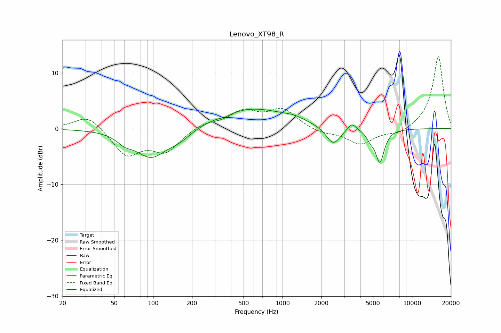

# Lenovo_XT98_R
See [usage instructions](https://github.com/jaakkopasanen/AutoEq#usage) for more options and info.

### Parametric EQs
Apply preamp of -3.6 dB when using parametric equalizer.

|   # | Type    |   Fc (Hz) |    Q |   Gain (dB) |
|-----|---------|-----------|------|-------------|
|   1 | Peaking |        60 | 2.38 |        -1.2 |
|   2 | Peaking |        97 | 1.16 |        -5   |
|   3 | Peaking |       161 | 1.52 |        -1.5 |
|   4 | Peaking |       363 | 3.41 |        -0.4 |
|   5 | Peaking |       572 | 0.51 |         3.6 |
|   6 | Peaking |      1236 | 1.81 |         0.6 |
|   7 | Peaking |      2466 | 2.57 |        -3.2 |
|   8 | Peaking |      3435 | 4.28 |         1.4 |
|   9 | Peaking |      4769 | 5.06 |        -1.2 |
|  10 | Peaking |      5654 | 4.08 |        -5.9 |

### Fixed Band EQs
When using fixed band (also called graphic) equalizer, apply preamp of **-13.0 dB** (if available) and set gains manually with these parameters.

|   # | Type    |   Fc (Hz) |    Q |   Gain (dB) |
|-----|---------|-----------|------|-------------|
|   1 | Peaking |        31 | 1.41 |         2.6 |
|   2 | Peaking |        62 | 1.41 |        -4.7 |
|   3 | Peaking |       125 | 1.41 |        -3.9 |
|   4 | Peaking |       250 | 1.41 |         1   |
|   5 | Peaking |       500 | 1.41 |         2.9 |
|   6 | Peaking |      1000 | 1.41 |         3.3 |
|   7 | Peaking |      2000 | 1.41 |        -0.8 |
|   8 | Peaking |      4000 | 1.41 |        -2.8 |
|   9 | Peaking |      8000 | 1.41 |        -1.1 |
|  10 | Peaking |     16000 | 1.41 |        13.1 |

### Graphs

