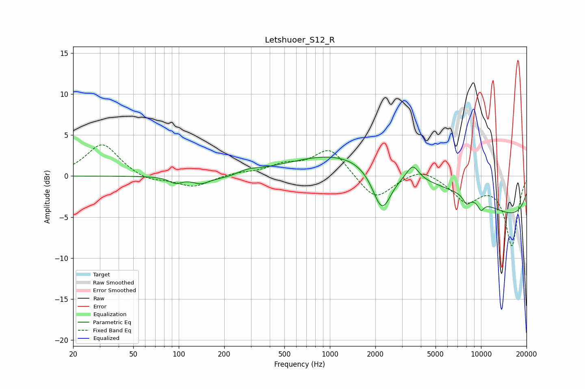

# Letshuoer_S12_R
See [usage instructions](https://github.com/jaakkopasanen/AutoEq#usage) for more options and info.

### Parametric EQs
Apply preamp of -2.4 dB when using parametric equalizer.

|   # | Type    |   Fc (Hz) |    Q |   Gain (dB) |
|-----|---------|-----------|------|-------------|
|   1 | Peaking |        95 | 3.24 |        -0.7 |
|   2 | Peaking |       140 | 2.43 |        -0.8 |
|   3 | Peaking |       224 | 1.1  |        -0.6 |
|   4 | Peaking |       280 | 1.78 |         0.7 |
|   5 | Peaking |      2211 | 2.24 |        -5.4 |
|   6 | Peaking |      3248 | 0.2  |         5.2 |
|   7 | Peaking |      3538 | 3.54 |         1.8 |
|   8 | Peaking |      8032 | 5.86 |        -1   |
|   9 | Peaking |     10000 | 0.18 |        -6.6 |
|  10 | Peaking |     10000 | 5.89 |        -1   |

### Fixed Band EQs
When using fixed band (also called graphic) equalizer, apply preamp of **-3.9 dB** (if available) and set gains manually with these parameters.

|   # | Type    |   Fc (Hz) |    Q |   Gain (dB) |
|-----|---------|-----------|------|-------------|
|   1 | Peaking |        31 | 1.41 |         4   |
|   2 | Peaking |        62 | 1.41 |        -0.7 |
|   3 | Peaking |       125 | 1.41 |        -1.3 |
|   4 | Peaking |       250 | 1.41 |         0.3 |
|   5 | Peaking |       500 | 1.41 |         1.2 |
|   6 | Peaking |      1000 | 1.41 |         3.4 |
|   7 | Peaking |      2000 | 1.41 |        -3   |
|   8 | Peaking |      4000 | 1.41 |         1.2 |
|   9 | Peaking |      8000 | 1.41 |        -2.9 |
|  10 | Peaking |     16000 | 1.41 |        -8.4 |

### Graphs

