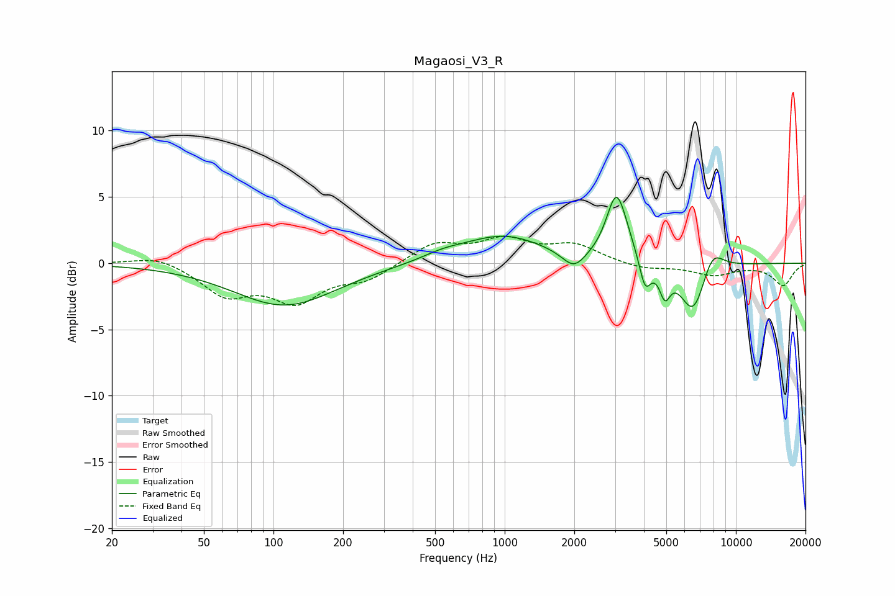

# Magaosi_V3_R
See [usage instructions](https://github.com/jaakkopasanen/AutoEq#usage) for more options and info.

### Parametric EQs
Apply preamp of -5.1 dB when using parametric equalizer.

|   # | Type    |   Fc (Hz) |    Q |   Gain (dB) |
|-----|---------|-----------|------|-------------|
|   1 | Peaking |       112 | 0.64 |        -3.2 |
|   2 | Peaking |       539 | 1.57 |         0.4 |
|   3 | Peaking |       984 | 0.78 |         2.1 |
|   4 | Peaking |      1993 | 2.81 |        -1.3 |
|   5 | Peaking |      3032 | 3.37 |         4.3 |
|   6 | Peaking |      3240 | 2.6  |         1   |
|   7 | Peaking |      4048 | 5.67 |        -2.3 |
|   8 | Peaking |      4931 | 6    |        -2   |
|   9 | Peaking |      6552 | 2.37 |        -4   |
|  10 | Peaking |      7873 | 2.71 |         2   |

### Fixed Band EQs
When using fixed band (also called graphic) equalizer, apply preamp of **-2.1 dB** (if available) and set gains manually with these parameters.

|   # | Type    |   Fc (Hz) |    Q |   Gain (dB) |
|-----|---------|-----------|------|-------------|
|   1 | Peaking |        31 | 1.41 |         0.7 |
|   2 | Peaking |        62 | 1.41 |        -2.3 |
|   3 | Peaking |       125 | 1.41 |        -2.7 |
|   4 | Peaking |       250 | 1.41 |        -1.1 |
|   5 | Peaking |       500 | 1.41 |         1.5 |
|   6 | Peaking |      1000 | 1.41 |         1.6 |
|   7 | Peaking |      2000 | 1.41 |         1.3 |
|   8 | Peaking |      4000 | 1.41 |        -0.5 |
|   9 | Peaking |      8000 | 1.41 |        -0.8 |
|  10 | Peaking |     16000 | 1.41 |        -1.7 |

### Graphs

