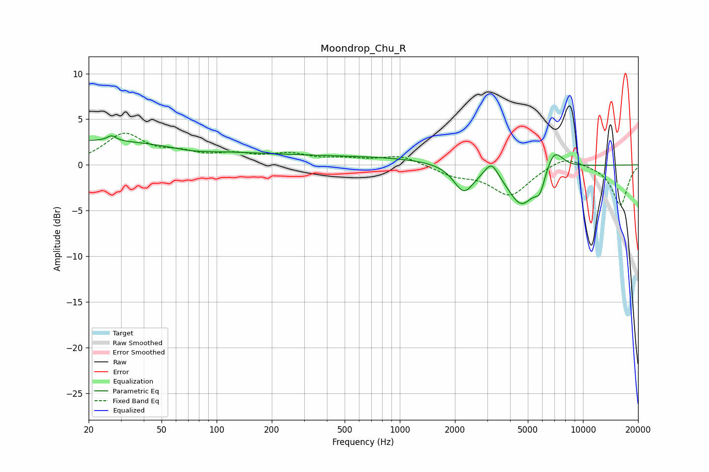

# Moondrop_Chu_R
See [usage instructions](https://github.com/jaakkopasanen/AutoEq#usage) for more options and info.

### Parametric EQs
Apply preamp of -3.3 dB when using parametric equalizer.

|   # | Type    |   Fc (Hz) |    Q |   Gain (dB) |
|-----|---------|-----------|------|-------------|
|   1 | Peaking |        20 | 0.22 |         2.6 |
|   2 | Peaking |        26 | 5.97 |        -2.3 |
|   3 | Peaking |        26 | 5.94 |         2.9 |
|   4 | Peaking |        74 | 1.08 |        -0.5 |
|   5 | Peaking |       405 | 0.21 |         0.9 |
|   6 | Peaking |      2237 | 2.55 |        -3   |
|   7 | Peaking |      3169 | 4.01 |         1.6 |
|   8 | Peaking |      4616 | 1.82 |        -4.4 |
|   9 | Peaking |      5818 | 4.91 |        -1.9 |
|  10 | Peaking |      6957 | 2.83 |         2.4 |

### Fixed Band EQs
When using fixed band (also called graphic) equalizer, apply preamp of **-3.6 dB** (if available) and set gains manually with these parameters.

|   # | Type    |   Fc (Hz) |    Q |   Gain (dB) |
|-----|---------|-----------|------|-------------|
|   1 | Peaking |        31 | 1.41 |         3.2 |
|   2 | Peaking |        62 | 1.41 |         1   |
|   3 | Peaking |       125 | 1.41 |         0.9 |
|   4 | Peaking |       250 | 1.41 |         1   |
|   5 | Peaking |       500 | 1.41 |         0.5 |
|   6 | Peaking |      1000 | 1.41 |         1   |
|   7 | Peaking |      2000 | 1.41 |        -1   |
|   8 | Peaking |      4000 | 1.41 |        -3.3 |
|   9 | Peaking |      8000 | 1.41 |         1.2 |
|  10 | Peaking |     16000 | 1.41 |        -4.4 |

### Graphs

