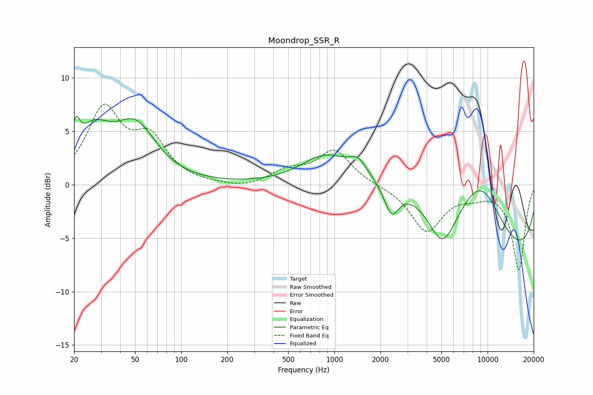

# Moondrop_SSR_R
See [usage instructions](https://github.com/jaakkopasanen/AutoEq#usage) for more options and info.

### Parametric EQs
Apply preamp of -6.5 dB when using parametric equalizer.

|   # | Type    |   Fc (Hz) |    Q |   Gain (dB) |
|-----|---------|-----------|------|-------------|
|   1 | Peaking |        21 | 5.91 |         2.5 |
|   2 | Peaking |        26 | 1.22 |         4.2 |
|   3 | Peaking |        50 | 1.04 |         4.9 |
|   4 | Peaking |       873 | 0.91 |         2.5 |
|   5 | Peaking |      1429 | 2.56 |         1.3 |
|   6 | Peaking |      2360 | 2.94 |        -2.9 |
|   7 | Peaking |      3665 | 0.4  |         4.5 |
|   8 | Peaking |      5083 | 1.49 |        -4.6 |
|   9 | Peaking |      9058 | 0.83 |         5.5 |
|  10 | Peaking |     10000 | 0.18 |        -7.6 |

### Fixed Band EQs
When using fixed band (also called graphic) equalizer, apply preamp of **-7.6 dB** (if available) and set gains manually with these parameters.

|   # | Type    |   Fc (Hz) |    Q |   Gain (dB) |
|-----|---------|-----------|------|-------------|
|   1 | Peaking |        31 | 1.41 |         6.8 |
|   2 | Peaking |        62 | 1.41 |         3.8 |
|   3 | Peaking |       125 | 1.41 |        -0   |
|   4 | Peaking |       250 | 1.41 |        -0.4 |
|   5 | Peaking |       500 | 1.41 |         1.2 |
|   6 | Peaking |      1000 | 1.41 |         3.2 |
|   7 | Peaking |      2000 | 1.41 |        -0   |
|   8 | Peaking |      4000 | 1.41 |        -4.3 |
|   9 | Peaking |      8000 | 1.41 |        -0.7 |
|  10 | Peaking |     16000 | 1.41 |        -7.9 |

### Graphs

