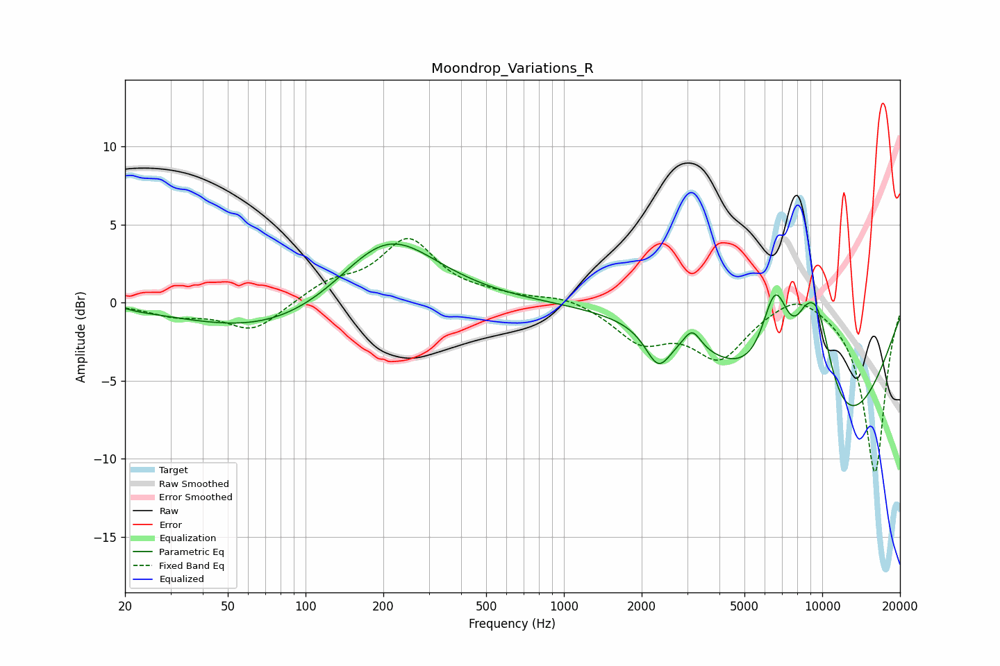

# Moondrop_Variations_R
See [usage instructions](https://github.com/jaakkopasanen/AutoEq#usage) for more options and info.

### Parametric EQs
Apply preamp of -3.9 dB when using parametric equalizer.

|   # | Type    |   Fc (Hz) |    Q |   Gain (dB) |
|-----|---------|-----------|------|-------------|
|   1 | Peaking |        20 | 5.59 |         0.1 |
|   2 | Peaking |        79 | 0.43 |        -2.1 |
|   3 | Peaking |       207 | 0.74 |         4.8 |
|   4 | Peaking |      2317 | 2.93 |        -2.3 |
|   5 | Peaking |      3138 | 4.11 |         1.3 |
|   6 | Peaking |      6576 | 2.51 |         5.8 |
|   7 | Peaking |      7704 | 1.67 |         1   |
|   8 | Peaking |      8559 | 3.46 |         1.4 |
|   9 | Peaking |      9560 | 1.93 |         7.3 |
|  10 | Peaking |     10000 | 0.4  |        -9.8 |

### Fixed Band EQs
When using fixed band (also called graphic) equalizer, apply preamp of **-4.2 dB** (if available) and set gains manually with these parameters.

|   # | Type    |   Fc (Hz) |    Q |   Gain (dB) |
|-----|---------|-----------|------|-------------|
|   1 | Peaking |        31 | 1.41 |        -0.7 |
|   2 | Peaking |        62 | 1.41 |        -1.8 |
|   3 | Peaking |       125 | 1.41 |         1.1 |
|   4 | Peaking |       250 | 1.41 |         3.9 |
|   5 | Peaking |       500 | 1.41 |         0.3 |
|   6 | Peaking |      1000 | 1.41 |         0.5 |
|   7 | Peaking |      2000 | 1.41 |        -2.3 |
|   8 | Peaking |      4000 | 1.41 |        -3.3 |
|   9 | Peaking |      8000 | 1.41 |         1.1 |
|  10 | Peaking |     16000 | 1.41 |       -10.9 |

### Graphs

