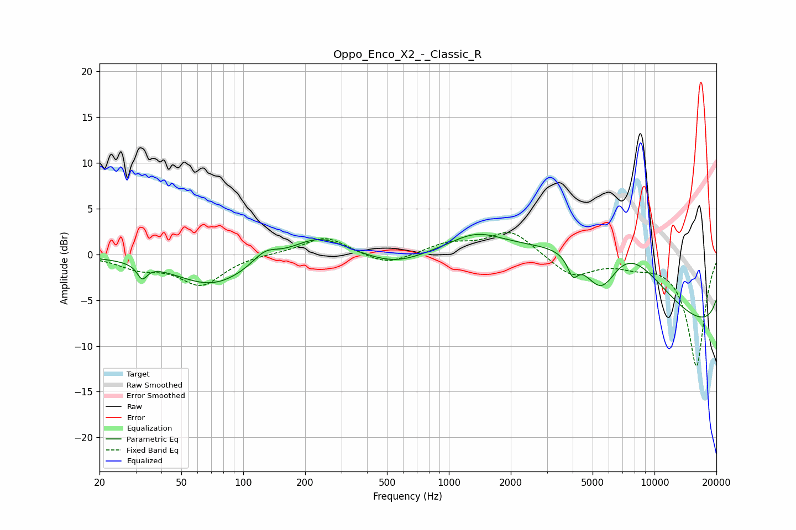

# Oppo_Enco_X2_-_Classic_R
See [usage instructions](https://github.com/jaakkopasanen/AutoEq#usage) for more options and info.

### Parametric EQs
Apply preamp of -2.3 dB when using parametric equalizer.

|   # | Type    |   Fc (Hz) |    Q |   Gain (dB) |
|-----|---------|-----------|------|-------------|
|   1 | Peaking |        32 | 6    |        -1.5 |
|   2 | Peaking |        71 | 0.77 |        -3.4 |
|   3 | Peaking |       127 | 2.31 |         1.4 |
|   4 | Peaking |       233 | 1.13 |         2.2 |
|   5 | Peaking |       552 | 0.99 |        -1.4 |
|   6 | Peaking |      1357 | 1.11 |         1.9 |
|   7 | Peaking |      4006 | 5.54 |        -2   |
|   8 | Peaking |      5518 | 1.46 |        -7   |
|   9 | Peaking |      6531 | 0.33 |        19.8 |
|  10 | Peaking |     10000 | 0.18 |       -17.6 |

### Fixed Band EQs
When using fixed band (also called graphic) equalizer, apply preamp of **-2.5 dB** (if available) and set gains manually with these parameters.

|   # | Type    |   Fc (Hz) |    Q |   Gain (dB) |
|-----|---------|-----------|------|-------------|
|   1 | Peaking |        31 | 1.41 |        -1.3 |
|   2 | Peaking |        62 | 1.41 |        -3.2 |
|   3 | Peaking |       125 | 1.41 |         0.1 |
|   4 | Peaking |       250 | 1.41 |         2   |
|   5 | Peaking |       500 | 1.41 |        -1.3 |
|   6 | Peaking |      1000 | 1.41 |         1.2 |
|   7 | Peaking |      2000 | 1.41 |         2.6 |
|   8 | Peaking |      4000 | 1.41 |        -2.4 |
|   9 | Peaking |      8000 | 1.41 |        -0.8 |
|  10 | Peaking |     16000 | 1.41 |       -12.2 |

### Graphs

