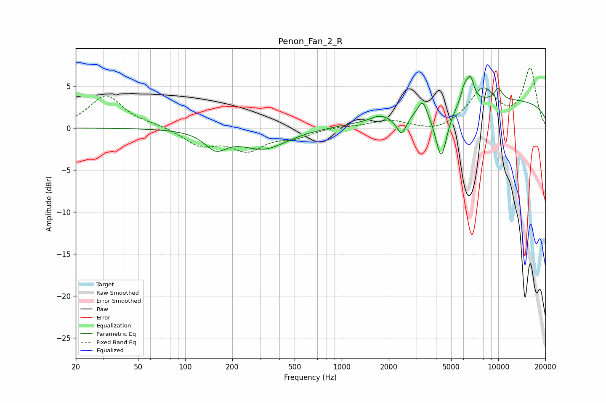

# Penon_Fan_2_R
See [usage instructions](https://github.com/jaakkopasanen/AutoEq#usage) for more options and info.

### Parametric EQs
Apply preamp of -6.2 dB when using parametric equalizer.

|   # | Type    |   Fc (Hz) |    Q |   Gain (dB) |
|-----|---------|-----------|------|-------------|
|   1 | Peaking |       157 | 2.05 |        -2   |
|   2 | Peaking |       318 | 0.95 |        -2.4 |
|   3 | Peaking |      1721 | 3.29 |         0.5 |
|   4 | Peaking |      2410 | 4.54 |        -2.4 |
|   5 | Peaking |      3282 | 5.28 |         1.8 |
|   6 | Peaking |      4323 | 3.75 |        -6.2 |
|   7 | Peaking |      6078 | 6    |         1.8 |
|   8 | Peaking |      6645 | 5.96 |         2.6 |
|   9 | Peaking |     10000 | 0.18 |         3.4 |
|  10 | Peaking |     10000 | 4.94 |         1.4 |

### Fixed Band EQs
When using fixed band (also called graphic) equalizer, apply preamp of **-7.2 dB** (if available) and set gains manually with these parameters.

|   # | Type    |   Fc (Hz) |    Q |   Gain (dB) |
|-----|---------|-----------|------|-------------|
|   1 | Peaking |        31 | 1.41 |         3.9 |
|   2 | Peaking |        62 | 1.41 |         0.3 |
|   3 | Peaking |       125 | 1.41 |        -1.9 |
|   4 | Peaking |       250 | 1.41 |        -2.4 |
|   5 | Peaking |       500 | 1.41 |        -0.9 |
|   6 | Peaking |      1000 | 1.41 |         0.2 |
|   7 | Peaking |      2000 | 1.41 |         0.9 |
|   8 | Peaking |      4000 | 1.41 |        -0.6 |
|   9 | Peaking |      8000 | 1.41 |         4.5 |
|  10 | Peaking |     16000 | 1.41 |         7   |

### Graphs

