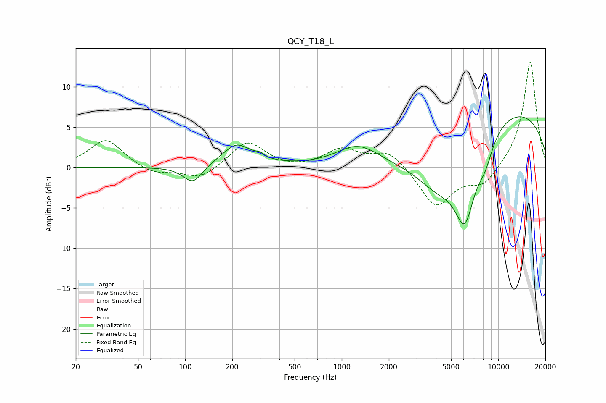

# QCY_T18_L
See [usage instructions](https://github.com/jaakkopasanen/AutoEq#usage) for more options and info.

### Parametric EQs
Apply preamp of -6.4 dB when using parametric equalizer.

|   # | Type    |   Fc (Hz) |    Q |   Gain (dB) |
|-----|---------|-----------|------|-------------|
|   1 | Peaking |       112 | 2.29 |        -2.3 |
|   2 | Peaking |       211 | 3.35 |         0.3 |
|   3 | Peaking |       215 | 1.28 |         2.6 |
|   4 | Peaking |       300 | 5.91 |         0.4 |
|   5 | Peaking |      1266 | 1.07 |         2.5 |
|   6 | Peaking |      2626 | 0.64 |        -1.2 |
|   7 | Peaking |      4202 | 0.9  |        -5.8 |
|   8 | Peaking |      6116 | 1.92 |        -9.2 |
|   9 | Peaking |      8243 | 2.36 |        -2.9 |
|  10 | Peaking |      9956 | 0.23 |         7.7 |

### Fixed Band EQs
When using fixed band (also called graphic) equalizer, apply preamp of **-13.2 dB** (if available) and set gains manually with these parameters.

|   # | Type    |   Fc (Hz) |    Q |   Gain (dB) |
|-----|---------|-----------|------|-------------|
|   1 | Peaking |        31 | 1.41 |         3.5 |
|   2 | Peaking |        62 | 1.41 |        -0.9 |
|   3 | Peaking |       125 | 1.41 |        -1.5 |
|   4 | Peaking |       250 | 1.41 |         3.3 |
|   5 | Peaking |       500 | 1.41 |        -0.3 |
|   6 | Peaking |      1000 | 1.41 |         2.2 |
|   7 | Peaking |      2000 | 1.41 |         2.1 |
|   8 | Peaking |      4000 | 1.41 |        -4.9 |
|   9 | Peaking |      8000 | 1.41 |        -2.2 |
|  10 | Peaking |     16000 | 1.41 |        13.3 |

### Graphs

