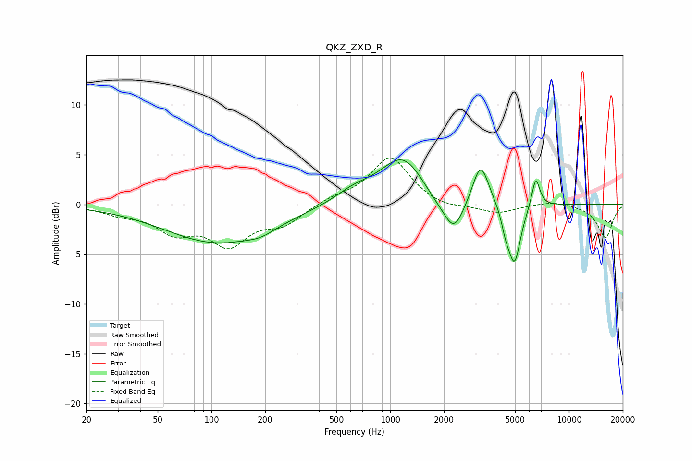

# QKZ_ZXD_R
See [usage instructions](https://github.com/jaakkopasanen/AutoEq#usage) for more options and info.

### Parametric EQs
Apply preamp of -4.6 dB when using parametric equalizer.

|   # | Type    |   Fc (Hz) |    Q |   Gain (dB) |
|-----|---------|-----------|------|-------------|
|   1 | Peaking |       108 | 0.47 |        -3.8 |
|   2 | Peaking |       190 | 1.85 |        -0.6 |
|   3 | Peaking |       629 | 1.28 |         1.2 |
|   4 | Peaking |      1180 | 1.13 |         4.8 |
|   5 | Peaking |      1760 | 1.8  |        -0.8 |
|   6 | Peaking |      2271 | 2.41 |        -3.5 |
|   7 | Peaking |      3205 | 3.06 |         4.3 |
|   8 | Peaking |      4429 | 5.95 |        -1.6 |
|   9 | Peaking |      4959 | 4.03 |        -5.9 |
|  10 | Peaking |      6520 | 5.99 |         3.1 |

### Fixed Band EQs
When using fixed band (also called graphic) equalizer, apply preamp of **-4.7 dB** (if available) and set gains manually with these parameters.

|   # | Type    |   Fc (Hz) |    Q |   Gain (dB) |
|-----|---------|-----------|------|-------------|
|   1 | Peaking |        31 | 1.41 |        -0.8 |
|   2 | Peaking |        62 | 1.41 |        -2.5 |
|   3 | Peaking |       125 | 1.41 |        -3.7 |
|   4 | Peaking |       250 | 1.41 |        -1.8 |
|   5 | Peaking |       500 | 1.41 |         0.6 |
|   6 | Peaking |      1000 | 1.41 |         4.8 |
|   7 | Peaking |      2000 | 1.41 |        -0.5 |
|   8 | Peaking |      4000 | 1.41 |        -0.9 |
|   9 | Peaking |      8000 | 1.41 |         0.4 |
|  10 | Peaking |     16000 | 1.41 |        -3.3 |

### Graphs

