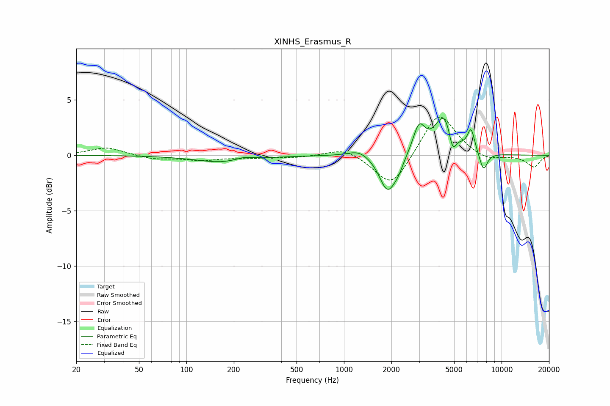

# XINHS_Erasmus_R
See [usage instructions](https://github.com/jaakkopasanen/AutoEq#usage) for more options and info.

### Parametric EQs
Apply preamp of -3.4 dB when using parametric equalizer.

|   # | Type    |   Fc (Hz) |    Q |   Gain (dB) |
|-----|---------|-----------|------|-------------|
|   1 | Peaking |       174 | 0.81 |        -0.7 |
|   2 | Peaking |       232 | 2.23 |         0.3 |
|   3 | Peaking |      1253 | 2.03 |         0.6 |
|   4 | Peaking |      1893 | 2.67 |        -3.4 |
|   5 | Peaking |      2217 | 4.6  |        -0.7 |
|   6 | Peaking |      2994 | 3.74 |         2.5 |
|   7 | Peaking |      4352 | 2.29 |         3.7 |
|   8 | Peaking |      4888 | 6    |        -2   |
|   9 | Peaking |      6408 | 5.99 |         2   |
|  10 | Peaking |      7674 | 5.23 |        -1.7 |

### Fixed Band EQs
When using fixed band (also called graphic) equalizer, apply preamp of **-3.5 dB** (if available) and set gains manually with these parameters.

|   # | Type    |   Fc (Hz) |    Q |   Gain (dB) |
|-----|---------|-----------|------|-------------|
|   1 | Peaking |        31 | 1.41 |         0.7 |
|   2 | Peaking |        62 | 1.41 |        -0.4 |
|   3 | Peaking |       125 | 1.41 |        -0.4 |
|   4 | Peaking |       250 | 1.41 |        -0.2 |
|   5 | Peaking |       500 | 1.41 |        -0.2 |
|   6 | Peaking |      1000 | 1.41 |         0.7 |
|   7 | Peaking |      2000 | 1.41 |        -3   |
|   8 | Peaking |      4000 | 1.41 |         4   |
|   9 | Peaking |      8000 | 1.41 |        -0.6 |
|  10 | Peaking |     16000 | 1.41 |        -1.1 |

### Graphs

