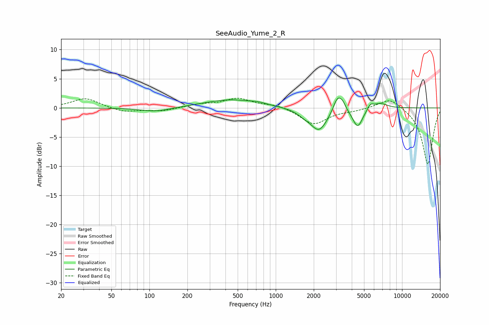

# SeeAudio_Yume_2_R
See [usage instructions](https://github.com/jaakkopasanen/AutoEq#usage) for more options and info.

### Parametric EQs
Apply preamp of -1.8 dB when using parametric equalizer.

|   # | Type    |   Fc (Hz) |    Q |   Gain (dB) |
|-----|---------|-----------|------|-------------|
|   1 | Peaking |       112 | 1.2  |        -0.7 |
|   2 | Peaking |       436 | 0.68 |         1.4 |
|   3 | Peaking |       731 | 2.39 |         0.3 |
|   4 | Peaking |      1667 | 2.73 |        -0.6 |
|   5 | Peaking |      2199 | 2.07 |        -3.9 |
|   6 | Peaking |      3090 | 4.08 |         2.7 |
|   7 | Peaking |      3395 | 6    |         0.9 |
|   8 | Peaking |      4454 | 3.59 |        -3.3 |
|   9 | Peaking |      5622 | 5.95 |         0.9 |
|  10 | Peaking |      6703 | 2.5  |         0.9 |

### Fixed Band EQs
When using fixed band (also called graphic) equalizer, apply preamp of **-1.8 dB** (if available) and set gains manually with these parameters.

|   # | Type    |   Fc (Hz) |    Q |   Gain (dB) |
|-----|---------|-----------|------|-------------|
|   1 | Peaking |        31 | 1.41 |         1.7 |
|   2 | Peaking |        62 | 1.41 |        -0.7 |
|   3 | Peaking |       125 | 1.41 |        -0.5 |
|   4 | Peaking |       250 | 1.41 |         0.6 |
|   5 | Peaking |       500 | 1.41 |         1.6 |
|   6 | Peaking |      1000 | 1.41 |         0.6 |
|   7 | Peaking |      2000 | 1.41 |        -2.8 |
|   8 | Peaking |      4000 | 1.41 |        -0.4 |
|   9 | Peaking |      8000 | 1.41 |         1.9 |
|  10 | Peaking |     16000 | 1.41 |        -9.7 |

### Graphs

