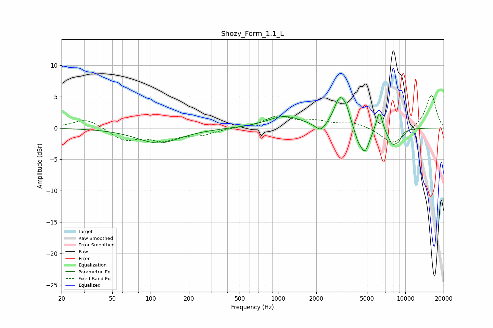

# Shozy_Form_1.1_L
See [usage instructions](https://github.com/jaakkopasanen/AutoEq#usage) for more options and info.

### Parametric EQs
Apply preamp of -4.9 dB when using parametric equalizer.

|   # | Type    |   Fc (Hz) |    Q |   Gain (dB) |
|-----|---------|-----------|------|-------------|
|   1 | Peaking |       115 | 0.83 |        -2.4 |
|   2 | Peaking |      1125 | 1.06 |         1.8 |
|   3 | Peaking |      2167 | 3.38 |        -1.4 |
|   4 | Peaking |      3062 | 3.1  |         4.7 |
|   5 | Peaking |      3447 | 5.98 |         1.3 |
|   6 | Peaking |      4229 | 6    |        -1.1 |
|   7 | Peaking |      4792 | 3.61 |        -4   |
|   8 | Peaking |      6250 | 5.63 |         3.4 |
|   9 | Peaking |      7937 | 3.29 |        -2.5 |
|  10 | Peaking |      8873 | 6    |        -1   |

### Fixed Band EQs
When using fixed band (also called graphic) equalizer, apply preamp of **-5.2 dB** (if available) and set gains manually with these parameters.

|   # | Type    |   Fc (Hz) |    Q |   Gain (dB) |
|-----|---------|-----------|------|-------------|
|   1 | Peaking |        31 | 1.41 |         1.6 |
|   2 | Peaking |        62 | 1.41 |        -1.9 |
|   3 | Peaking |       125 | 1.41 |        -1.8 |
|   4 | Peaking |       250 | 1.41 |        -0.9 |
|   5 | Peaking |       500 | 1.41 |         0.1 |
|   6 | Peaking |      1000 | 1.41 |         1.8 |
|   7 | Peaking |      2000 | 1.41 |         0.9 |
|   8 | Peaking |      4000 | 1.41 |         0.9 |
|   9 | Peaking |      8000 | 1.41 |        -2.7 |
|  10 | Peaking |     16000 | 1.41 |         5.3 |

### Graphs

