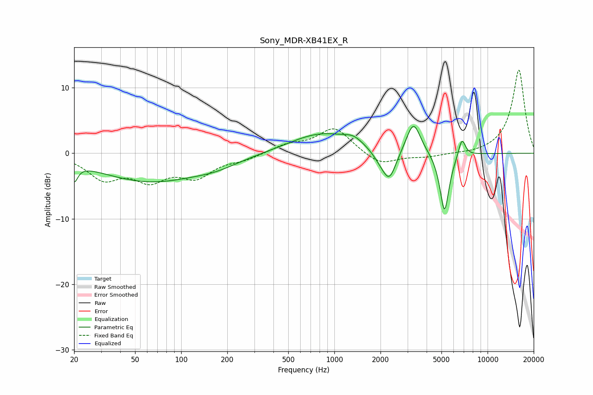

# Sony_MDR-XB41EX_R
See [usage instructions](https://github.com/jaakkopasanen/AutoEq#usage) for more options and info.

### Parametric EQs
Apply preamp of -4.2 dB when using parametric equalizer.

|   # | Type    |   Fc (Hz) |    Q |   Gain (dB) |
|-----|---------|-----------|------|-------------|
|   1 | Peaking |        20 | 6    |        -2.6 |
|   2 | Peaking |        62 | 0.42 |        -4.2 |
|   3 | Peaking |       170 | 0.93 |        -1   |
|   4 | Peaking |       824 | 0.68 |         3.1 |
|   5 | Peaking |      1334 | 2.29 |         1   |
|   6 | Peaking |      2016 | 2.53 |        -1.4 |
|   7 | Peaking |      2291 | 3.2  |        -4.1 |
|   8 | Peaking |      3283 | 3.06 |         4.9 |
|   9 | Peaking |      5233 | 4.54 |        -9.3 |
|  10 | Peaking |      6797 | 5.98 |         2.9 |

### Fixed Band EQs
When using fixed band (also called graphic) equalizer, apply preamp of **-12.8 dB** (if available) and set gains manually with these parameters.

|   # | Type    |   Fc (Hz) |    Q |   Gain (dB) |
|-----|---------|-----------|------|-------------|
|   1 | Peaking |        31 | 1.41 |        -3.6 |
|   2 | Peaking |        62 | 1.41 |        -3.5 |
|   3 | Peaking |       125 | 1.41 |        -3.2 |
|   4 | Peaking |       250 | 1.41 |        -0.8 |
|   5 | Peaking |       500 | 1.41 |         1.2 |
|   6 | Peaking |      1000 | 1.41 |         3.9 |
|   7 | Peaking |      2000 | 1.41 |        -1.9 |
|   8 | Peaking |      4000 | 1.41 |        -0.5 |
|   9 | Peaking |      8000 | 1.41 |        -0.2 |
|  10 | Peaking |     16000 | 1.41 |        12.8 |

### Graphs

