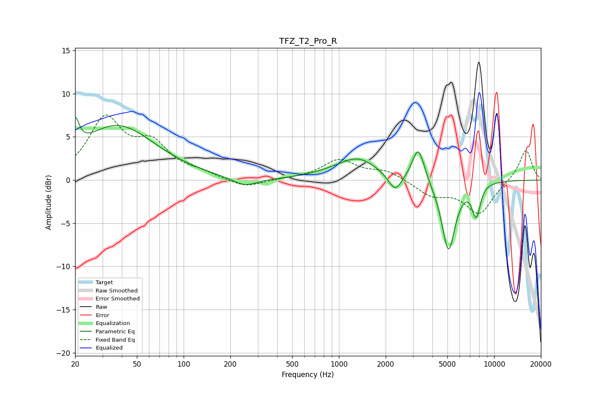

# TFZ_T2_Pro_R
See [usage instructions](https://github.com/jaakkopasanen/AutoEq#usage) for more options and info.

### Parametric EQs
Apply preamp of -7.4 dB when using parametric equalizer.

|   # | Type    |   Fc (Hz) |    Q |   Gain (dB) |
|-----|---------|-----------|------|-------------|
|   1 | Peaking |        20 | 5.72 |         3.4 |
|   2 | Peaking |        37 | 0.58 |         6.3 |
|   3 | Peaking |       247 | 1.69 |        -1   |
|   4 | Peaking |       863 | 1.05 |         0.3 |
|   5 | Peaking |      1330 | 1.12 |         2.4 |
|   6 | Peaking |      2302 | 3.27 |        -2.1 |
|   7 | Peaking |      3246 | 3.59 |         4.1 |
|   8 | Peaking |      5077 | 3.15 |        -8.3 |
|   9 | Peaking |      7403 | 6    |        -1.1 |
|  10 | Peaking |      7757 | 5.57 |        -2.8 |

### Fixed Band EQs
When using fixed band (also called graphic) equalizer, apply preamp of **-7.6 dB** (if available) and set gains manually with these parameters.

|   # | Type    |   Fc (Hz) |    Q |   Gain (dB) |
|-----|---------|-----------|------|-------------|
|   1 | Peaking |        31 | 1.41 |         6.8 |
|   2 | Peaking |        62 | 1.41 |         3.6 |
|   3 | Peaking |       125 | 1.41 |         0.7 |
|   4 | Peaking |       250 | 1.41 |        -1   |
|   5 | Peaking |       500 | 1.41 |         0.1 |
|   6 | Peaking |      1000 | 1.41 |         2.3 |
|   7 | Peaking |      2000 | 1.41 |         1   |
|   8 | Peaking |      4000 | 1.41 |        -1.7 |
|   9 | Peaking |      8000 | 1.41 |        -3.8 |
|  10 | Peaking |     16000 | 1.41 |         3.6 |

### Graphs

