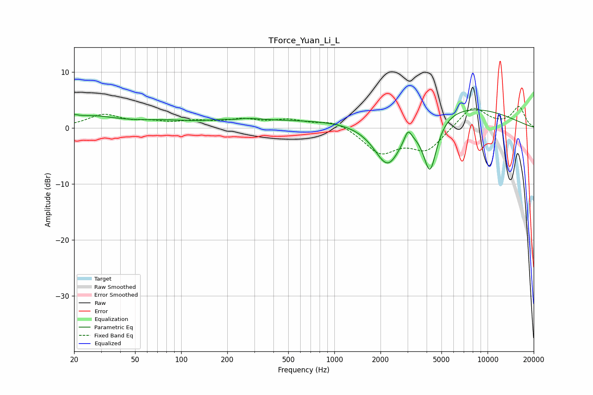

# TForce_Yuan_Li_L
See [usage instructions](https://github.com/jaakkopasanen/AutoEq#usage) for more options and info.

### Parametric EQs
Apply preamp of -3.3 dB when using parametric equalizer.

|   # | Type    |   Fc (Hz) |    Q |   Gain (dB) |
|-----|---------|-----------|------|-------------|
|   1 | Peaking |        20 | 5.97 |         0.5 |
|   2 | Peaking |        25 | 0.8  |         1.9 |
|   3 | Peaking |        78 | 0.73 |         0.9 |
|   4 | Peaking |       224 | 2.23 |        -0.8 |
|   5 | Peaking |       228 | 1.31 |         1.5 |
|   6 | Peaking |       550 | 0.39 |         1.1 |
|   7 | Peaking |      2231 | 1.48 |        -8.9 |
|   8 | Peaking |      3022 | 6    |         2.2 |
|   9 | Peaking |      4210 | 3.02 |       -10   |
|  10 | Peaking |      5529 | 0.33 |         4.3 |

### Fixed Band EQs
When using fixed band (also called graphic) equalizer, apply preamp of **-3.9 dB** (if available) and set gains manually with these parameters.

|   # | Type    |   Fc (Hz) |    Q |   Gain (dB) |
|-----|---------|-----------|------|-------------|
|   1 | Peaking |        31 | 1.41 |         2.2 |
|   2 | Peaking |        62 | 1.41 |         0.8 |
|   3 | Peaking |       125 | 1.41 |         1   |
|   4 | Peaking |       250 | 1.41 |         1.3 |
|   5 | Peaking |       500 | 1.41 |         1.2 |
|   6 | Peaking |      1000 | 1.41 |         1.4 |
|   7 | Peaking |      2000 | 1.41 |        -4.4 |
|   8 | Peaking |      4000 | 1.41 |        -3.9 |
|   9 | Peaking |      8000 | 1.41 |         4   |
|  10 | Peaking |     16000 | 1.41 |         3.7 |

### Graphs

