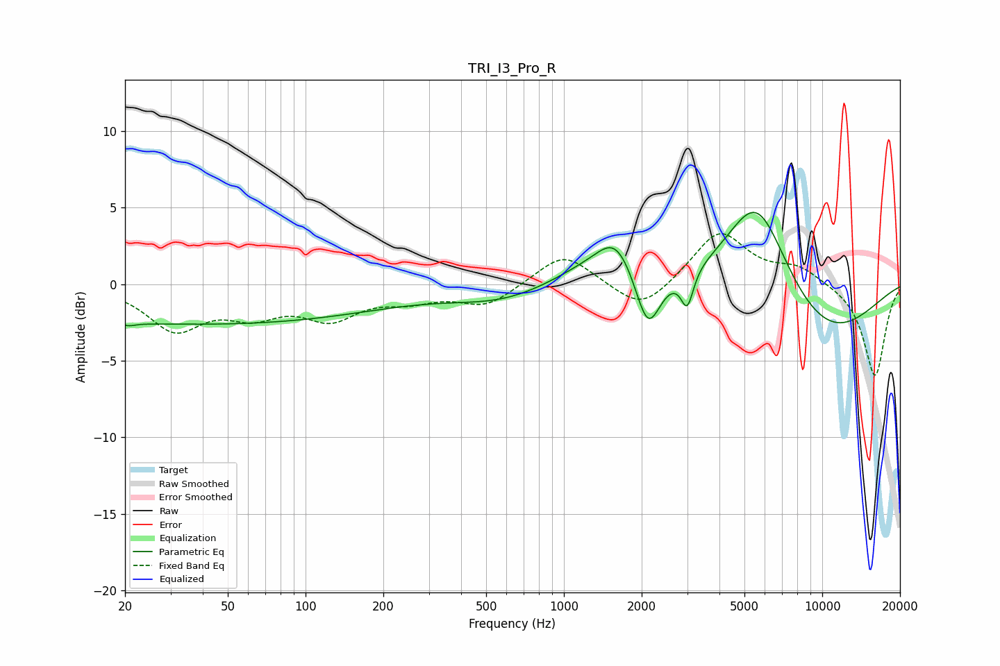

# TRI_I3_Pro_R
See [usage instructions](https://github.com/jaakkopasanen/AutoEq#usage) for more options and info.

### Parametric EQs
Apply preamp of -4.8 dB when using parametric equalizer.

|   # | Type    |   Fc (Hz) |    Q |   Gain (dB) |
|-----|---------|-----------|------|-------------|
|   1 | Peaking |        21 | 4.07 |        -2.3 |
|   2 | Peaking |        22 | 4.18 |         2.1 |
|   3 | Peaking |        39 | 0.18 |        -2.6 |
|   4 | Peaking |       571 | 0.74 |        -1   |
|   5 | Peaking |      1235 | 0.98 |         1.1 |
|   6 | Peaking |      1591 | 1.93 |         2.5 |
|   7 | Peaking |      2115 | 2.9  |        -4   |
|   8 | Peaking |      3002 | 5.96 |        -2.3 |
|   9 | Peaking |      5596 | 1.12 |         7   |
|  10 | Peaking |      9814 | 0.55 |        -3.9 |

### Fixed Band EQs
When using fixed band (also called graphic) equalizer, apply preamp of **-3.4 dB** (if available) and set gains manually with these parameters.

|   # | Type    |   Fc (Hz) |    Q |   Gain (dB) |
|-----|---------|-----------|------|-------------|
|   1 | Peaking |        31 | 1.41 |        -2.8 |
|   2 | Peaking |        62 | 1.41 |        -1.6 |
|   3 | Peaking |       125 | 1.41 |        -2   |
|   4 | Peaking |       250 | 1.41 |        -0.8 |
|   5 | Peaking |       500 | 1.41 |        -1.4 |
|   6 | Peaking |      1000 | 1.41 |         2.1 |
|   7 | Peaking |      2000 | 1.41 |        -1.9 |
|   8 | Peaking |      4000 | 1.41 |         3.5 |
|   9 | Peaking |      8000 | 1.41 |         1.1 |
|  10 | Peaking |     16000 | 1.41 |        -6.1 |

### Graphs

