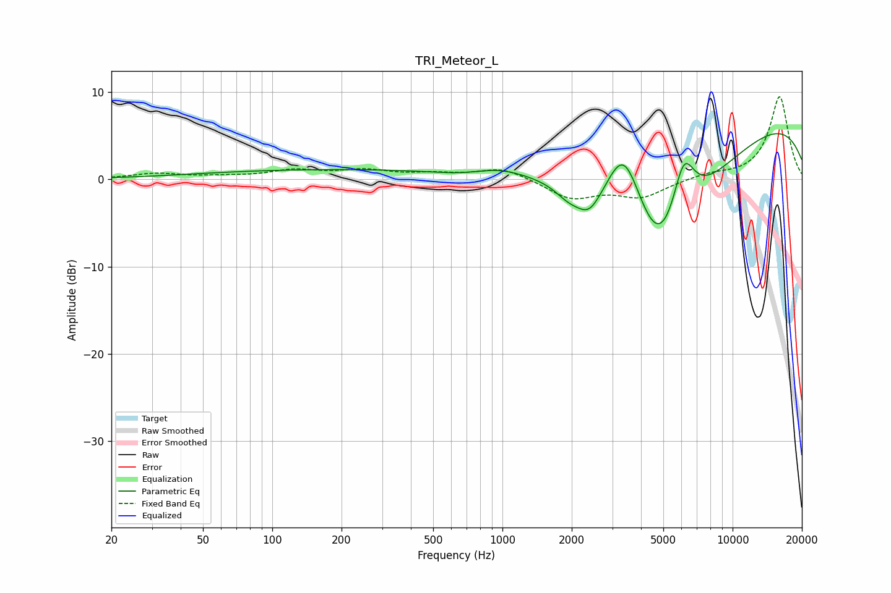

# TRI_Meteor_L
See [usage instructions](https://github.com/jaakkopasanen/AutoEq#usage) for more options and info.

### Parametric EQs
Apply preamp of -5.3 dB when using parametric equalizer.

|   # | Type    |   Fc (Hz) |    Q |   Gain (dB) |
|-----|---------|-----------|------|-------------|
|   1 | Peaking |       238 | 0.18 |         1.2 |
|   2 | Peaking |       721 | 0.94 |        -0.7 |
|   3 | Peaking |       941 | 1.16 |         1.1 |
|   4 | Peaking |      1935 | 2.41 |        -1.4 |
|   5 | Peaking |      2429 | 2.42 |        -4.2 |
|   6 | Peaking |      2511 | 3.39 |         0.8 |
|   7 | Peaking |      3379 | 1.69 |         8.5 |
|   8 | Peaking |      4832 | 0.66 |       -18.5 |
|   9 | Peaking |      6126 | 2.71 |         7.1 |
|  10 | Peaking |      8757 | 0.18 |         8.9 |

### Fixed Band EQs
When using fixed band (also called graphic) equalizer, apply preamp of **-9.6 dB** (if available) and set gains manually with these parameters.

|   # | Type    |   Fc (Hz) |    Q |   Gain (dB) |
|-----|---------|-----------|------|-------------|
|   1 | Peaking |        31 | 1.41 |         0.6 |
|   2 | Peaking |        62 | 1.41 |         0.2 |
|   3 | Peaking |       125 | 1.41 |         0.9 |
|   4 | Peaking |       250 | 1.41 |         0.9 |
|   5 | Peaking |       500 | 1.41 |         0.5 |
|   6 | Peaking |      1000 | 1.41 |         1.3 |
|   7 | Peaking |      2000 | 1.41 |        -2.2 |
|   8 | Peaking |      4000 | 1.41 |        -2   |
|   9 | Peaking |      8000 | 1.41 |         0.5 |
|  10 | Peaking |     16000 | 1.41 |         9.5 |

### Graphs

