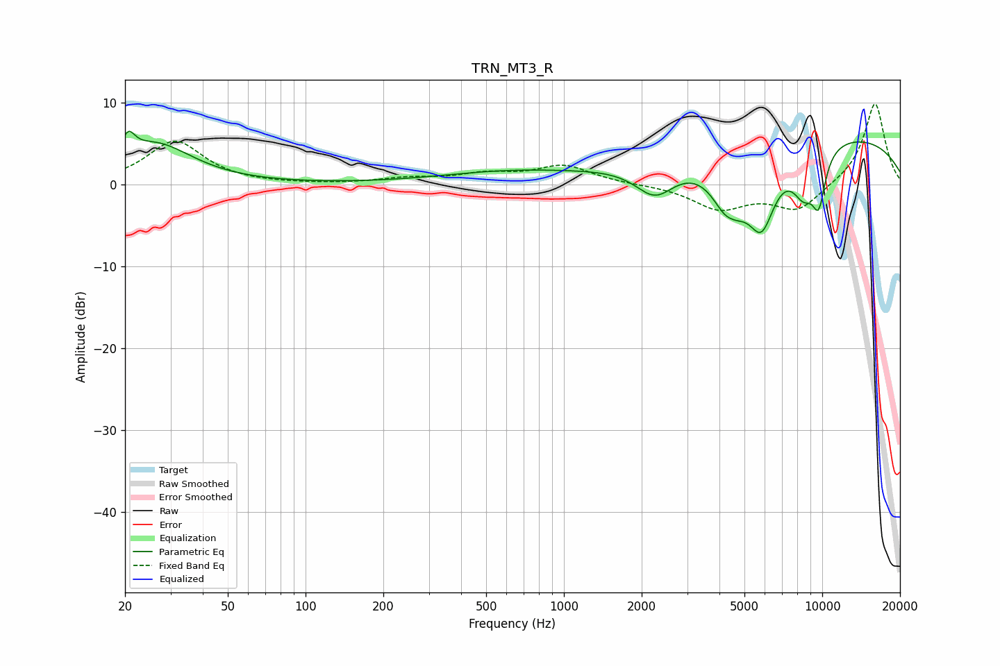

# TRN_MT3_R
See [usage instructions](https://github.com/jaakkopasanen/AutoEq#usage) for more options and info.

### Parametric EQs
Apply preamp of -6.6 dB when using parametric equalizer.

|   # | Type    |   Fc (Hz) |    Q |   Gain (dB) |
|-----|---------|-----------|------|-------------|
|   1 | Peaking |        21 | 5.73 |         2.5 |
|   2 | Peaking |        26 | 0.98 |         4.9 |
|   3 | Peaking |       600 | 0.53 |         1.4 |
|   4 | Peaking |      2257 | 1.79 |        -4   |
|   5 | Peaking |      4382 | 2.14 |        -7   |
|   6 | Peaking |      4437 | 4.8  |         0.8 |
|   7 | Peaking |      5826 | 2.43 |        -8.3 |
|   8 | Peaking |      8476 | 2.73 |        -5   |
|   9 | Peaking |      9172 | 0.21 |         6.4 |
|  10 | Peaking |      9698 | 4.65 |        -5.8 |

### Fixed Band EQs
When using fixed band (also called graphic) equalizer, apply preamp of **-9.9 dB** (if available) and set gains manually with these parameters.

|   # | Type    |   Fc (Hz) |    Q |   Gain (dB) |
|-----|---------|-----------|------|-------------|
|   1 | Peaking |        31 | 1.41 |         5.3 |
|   2 | Peaking |        62 | 1.41 |        -0   |
|   3 | Peaking |       125 | 1.41 |        -0   |
|   4 | Peaking |       250 | 1.41 |         0.6 |
|   5 | Peaking |       500 | 1.41 |         1.1 |
|   6 | Peaking |      1000 | 1.41 |         2.2 |
|   7 | Peaking |      2000 | 1.41 |         0   |
|   8 | Peaking |      4000 | 1.41 |        -2.9 |
|   9 | Peaking |      8000 | 1.41 |        -3.2 |
|  10 | Peaking |     16000 | 1.41 |        10   |

### Graphs

