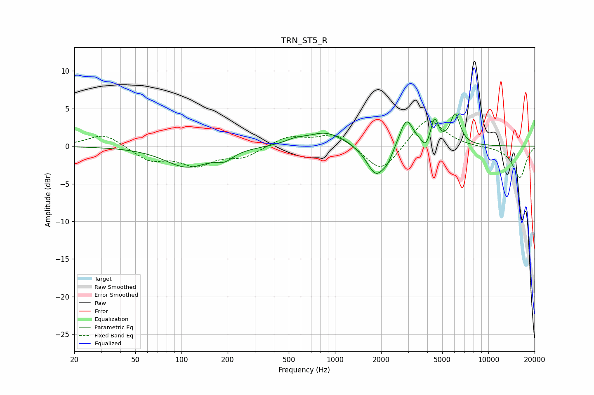

# TRN_ST5_R
See [usage instructions](https://github.com/jaakkopasanen/AutoEq#usage) for more options and info.

### Parametric EQs
Apply preamp of -4.4 dB when using parametric equalizer.

|   # | Type    |   Fc (Hz) |    Q |   Gain (dB) |
|-----|---------|-----------|------|-------------|
|   1 | Peaking |       109 | 0.98 |        -2.7 |
|   2 | Peaking |       192 | 2.65 |        -1   |
|   3 | Peaking |       551 | 2.17 |         0.5 |
|   4 | Peaking |       874 | 1.2  |         1.9 |
|   5 | Peaking |      1856 | 2.31 |        -4.1 |
|   6 | Peaking |      2208 | 4.46 |        -1   |
|   7 | Peaking |      2921 | 3.23 |         3.8 |
|   8 | Peaking |      3905 | 6    |        -1.2 |
|   9 | Peaking |      4461 | 5.88 |         3.3 |
|  10 | Peaking |      6077 | 4.27 |         4.1 |

### Fixed Band EQs
When using fixed band (also called graphic) equalizer, apply preamp of **-3.5 dB** (if available) and set gains manually with these parameters.

|   # | Type    |   Fc (Hz) |    Q |   Gain (dB) |
|-----|---------|-----------|------|-------------|
|   1 | Peaking |        31 | 1.41 |         1.7 |
|   2 | Peaking |        62 | 1.41 |        -1.8 |
|   3 | Peaking |       125 | 1.41 |        -2.3 |
|   4 | Peaking |       250 | 1.41 |        -1.4 |
|   5 | Peaking |       500 | 1.41 |         1.3 |
|   6 | Peaking |      1000 | 1.41 |         1.8 |
|   7 | Peaking |      2000 | 1.41 |        -3.7 |
|   8 | Peaking |      4000 | 1.41 |         4   |
|   9 | Peaking |      8000 | 1.41 |        -0.1 |
|  10 | Peaking |     16000 | 1.41 |        -4.2 |

### Graphs

