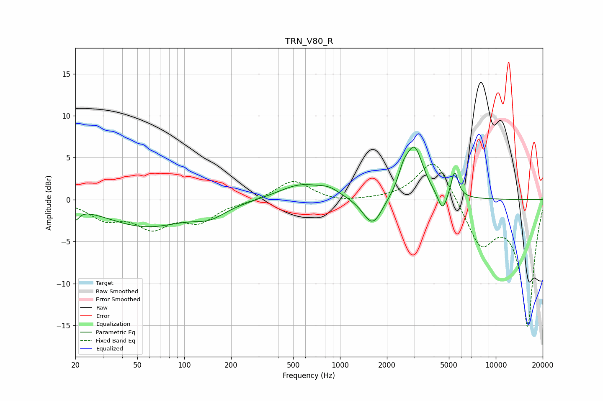

# TRN_V80_R
See [usage instructions](https://github.com/jaakkopasanen/AutoEq#usage) for more options and info.

### Parametric EQs
Apply preamp of -6.4 dB when using parametric equalizer.

|   # | Type    |   Fc (Hz) |    Q |   Gain (dB) |
|-----|---------|-----------|------|-------------|
|   1 | Peaking |        20 | 6    |        -1.3 |
|   2 | Peaking |        57 | 0.54 |        -3.1 |
|   3 | Peaking |       146 | 1.37 |        -1.3 |
|   4 | Peaking |       560 | 0.98 |         1.8 |
|   5 | Peaking |       853 | 2.13 |         0.7 |
|   6 | Peaking |      1617 | 2.25 |        -3.5 |
|   7 | Peaking |      2551 | 4.18 |         1.8 |
|   8 | Peaking |      3009 | 2.54 |         6   |
|   9 | Peaking |      4548 | 4.81 |        -2.3 |
|  10 | Peaking |      5441 | 5.98 |         3.2 |

### Fixed Band EQs
When using fixed band (also called graphic) equalizer, apply preamp of **-4.3 dB** (if available) and set gains manually with these parameters.

|   # | Type    |   Fc (Hz) |    Q |   Gain (dB) |
|-----|---------|-----------|------|-------------|
|   1 | Peaking |        31 | 1.41 |        -2.1 |
|   2 | Peaking |        62 | 1.41 |        -3   |
|   3 | Peaking |       125 | 1.41 |        -2.3 |
|   4 | Peaking |       250 | 1.41 |        -0.2 |
|   5 | Peaking |       500 | 1.41 |         2.3 |
|   6 | Peaking |      1000 | 1.41 |        -0.4 |
|   7 | Peaking |      2000 | 1.41 |         0   |
|   8 | Peaking |      4000 | 1.41 |         5.2 |
|   9 | Peaking |      8000 | 1.41 |        -5.2 |
|  10 | Peaking |     16000 | 1.41 |       -15   |

### Graphs

