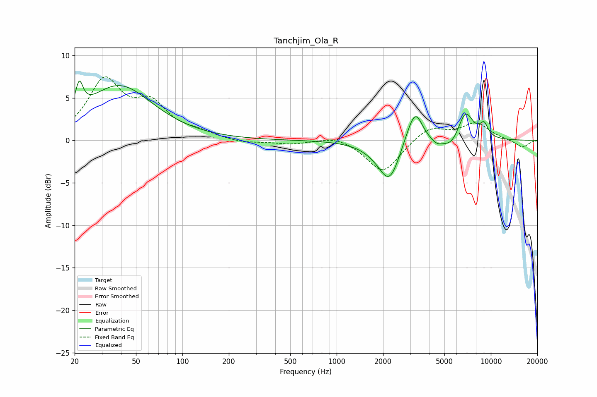

# Tanchjim_Ola_R
See [usage instructions](https://github.com/jaakkopasanen/AutoEq#usage) for more options and info.

### Parametric EQs
Apply preamp of -7.1 dB when using parametric equalizer.

|   # | Type    |   Fc (Hz) |    Q |   Gain (dB) |
|-----|---------|-----------|------|-------------|
|   1 | Peaking |        21 | 5.93 |         3.2 |
|   2 | Peaking |        39 | 0.65 |         6.4 |
|   3 | Peaking |      1866 | 1.43 |        -0.8 |
|   4 | Peaking |      2205 | 2.16 |        -4.2 |
|   5 | Peaking |      2949 | 2.76 |         1.1 |
|   6 | Peaking |      3258 | 3.09 |         3.3 |
|   7 | Peaking |      4464 | 3.75 |        -0.6 |
|   8 | Peaking |      5610 | 2.33 |        -1.4 |
|   9 | Peaking |      6826 | 2.58 |         3.6 |
|  10 | Peaking |      9024 | 4.67 |         1.5 |

### Fixed Band EQs
When using fixed band (also called graphic) equalizer, apply preamp of **-7.6 dB** (if available) and set gains manually with these parameters.

|   # | Type    |   Fc (Hz) |    Q |   Gain (dB) |
|-----|---------|-----------|------|-------------|
|   1 | Peaking |        31 | 1.41 |         6.8 |
|   2 | Peaking |        62 | 1.41 |         3.7 |
|   3 | Peaking |       125 | 1.41 |         0.7 |
|   4 | Peaking |       250 | 1.41 |        -0.4 |
|   5 | Peaking |       500 | 1.41 |        -0.4 |
|   6 | Peaking |      1000 | 1.41 |         0.6 |
|   7 | Peaking |      2000 | 1.41 |        -3.9 |
|   8 | Peaking |      4000 | 1.41 |         1.6 |
|   9 | Peaking |      8000 | 1.41 |         2   |
|  10 | Peaking |     16000 | 1.41 |        -0.9 |

### Graphs

