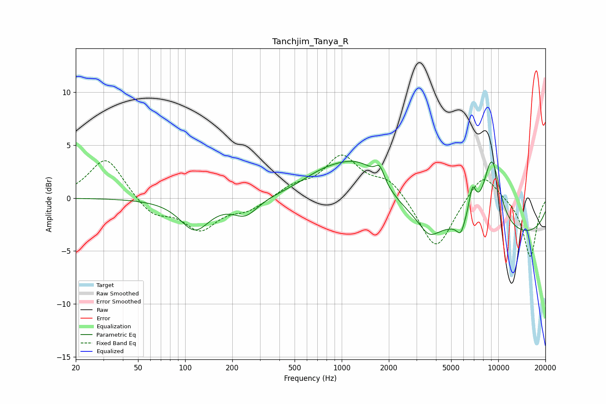

# Tanchjim_Tanya_R
See [usage instructions](https://github.com/jaakkopasanen/AutoEq#usage) for more options and info.

### Parametric EQs
Apply preamp of -3.6 dB when using parametric equalizer.

|   # | Type    |   Fc (Hz) |    Q |   Gain (dB) |
|-----|---------|-----------|------|-------------|
|   1 | Peaking |       115 | 1.51 |        -2.9 |
|   2 | Peaking |       243 | 1.79 |        -1.6 |
|   3 | Peaking |       776 | 0.86 |         1.7 |
|   4 | Peaking |      1334 | 0.89 |         3.4 |
|   5 | Peaking |      1750 | 5.04 |         1.4 |
|   6 | Peaking |      3614 | 2.3  |        -1.5 |
|   7 | Peaking |      5751 | 5.67 |        -1.2 |
|   8 | Peaking |      6839 | 5.75 |         2.7 |
|   9 | Peaking |      9085 | 2.18 |         7   |
|  10 | Peaking |     10000 | 0.18 |        -3.8 |

### Fixed Band EQs
When using fixed band (also called graphic) equalizer, apply preamp of **-4.2 dB** (if available) and set gains manually with these parameters.

|   # | Type    |   Fc (Hz) |    Q |   Gain (dB) |
|-----|---------|-----------|------|-------------|
|   1 | Peaking |        31 | 1.41 |         3.9 |
|   2 | Peaking |        62 | 1.41 |        -1.6 |
|   3 | Peaking |       125 | 1.41 |        -2.8 |
|   4 | Peaking |       250 | 1.41 |        -1   |
|   5 | Peaking |       500 | 1.41 |         1   |
|   6 | Peaking |      1000 | 1.41 |         3.8 |
|   7 | Peaking |      2000 | 1.41 |         1.7 |
|   8 | Peaking |      4000 | 1.41 |        -5.1 |
|   9 | Peaking |      8000 | 1.41 |         2.7 |
|  10 | Peaking |     16000 | 1.41 |        -5.6 |

### Graphs

