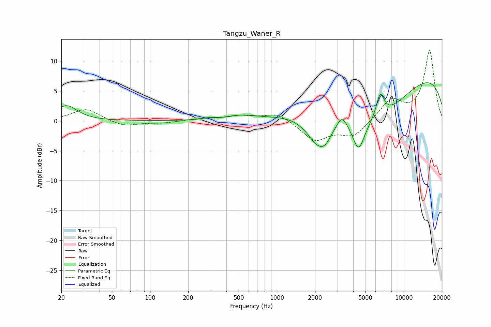

# Tangzu_Waner_R
See [usage instructions](https://github.com/jaakkopasanen/AutoEq#usage) for more options and info.

### Parametric EQs
Apply preamp of -6.5 dB when using parametric equalizer.

|   # | Type    |   Fc (Hz) |    Q |   Gain (dB) |
|-----|---------|-----------|------|-------------|
|   1 | Peaking |        22 | 1.7  |         2.5 |
|   2 | Peaking |       290 | 2.73 |         0.3 |
|   3 | Peaking |       527 | 1.41 |         0.7 |
|   4 | Peaking |      2125 | 1.5  |        -5.3 |
|   5 | Peaking |      2419 | 3.17 |        -1.3 |
|   6 | Peaking |      3259 | 3.76 |         1.9 |
|   7 | Peaking |      4407 | 2.97 |        -5   |
|   8 | Peaking |      5903 | 0.46 |        -8.8 |
|   9 | Peaking |      6527 | 4.14 |         4.1 |
|  10 | Peaking |      9051 | 0.19 |        10.1 |

### Fixed Band EQs
When using fixed band (also called graphic) equalizer, apply preamp of **-11.9 dB** (if available) and set gains manually with these parameters.

|   # | Type    |   Fc (Hz) |    Q |   Gain (dB) |
|-----|---------|-----------|------|-------------|
|   1 | Peaking |        31 | 1.41 |         2   |
|   2 | Peaking |        62 | 1.41 |        -1   |
|   3 | Peaking |       125 | 1.41 |        -0.3 |
|   4 | Peaking |       250 | 1.41 |         0.3 |
|   5 | Peaking |       500 | 1.41 |         0.8 |
|   6 | Peaking |      1000 | 1.41 |         1.4 |
|   7 | Peaking |      2000 | 1.41 |        -3.2 |
|   8 | Peaking |      4000 | 1.41 |        -2.5 |
|   9 | Peaking |      8000 | 1.41 |         3.4 |
|  10 | Peaking |     16000 | 1.41 |        11.7 |

### Graphs

