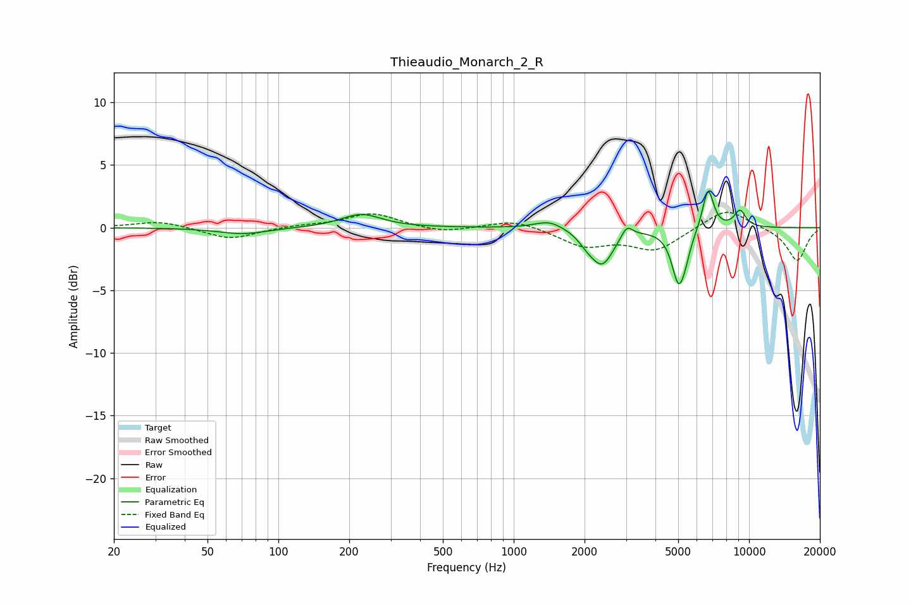

# Thieaudio_Monarch_2_R
See [usage instructions](https://github.com/jaakkopasanen/AutoEq#usage) for more options and info.

### Parametric EQs
Apply preamp of -3.0 dB when using parametric equalizer.

|   # | Type    |   Fc (Hz) |    Q |   Gain (dB) |
|-----|---------|-----------|------|-------------|
|   1 | Peaking |        71 | 1.36 |        -0.5 |
|   2 | Peaking |       225 | 1.66 |         1.1 |
|   3 | Peaking |      1419 | 2.3  |         0.7 |
|   4 | Peaking |      2038 | 4.31 |        -0.5 |
|   5 | Peaking |      2373 | 2.85 |        -2.9 |
|   6 | Peaking |      3024 | 5.88 |         1   |
|   7 | Peaking |      5018 | 4.8  |        -4.1 |
|   8 | Peaking |      5370 | 6    |        -0.9 |
|   9 | Peaking |      6698 | 5.81 |         3.3 |
|  10 | Peaking |      9153 | 5.03 |         1.3 |

### Fixed Band EQs
When using fixed band (also called graphic) equalizer, apply preamp of **-1.3 dB** (if available) and set gains manually with these parameters.

|   # | Type    |   Fc (Hz) |    Q |   Gain (dB) |
|-----|---------|-----------|------|-------------|
|   1 | Peaking |        31 | 1.41 |         0.5 |
|   2 | Peaking |        62 | 1.41 |        -1   |
|   3 | Peaking |       125 | 1.41 |         0.2 |
|   4 | Peaking |       250 | 1.41 |         1.2 |
|   5 | Peaking |       500 | 1.41 |        -0.4 |
|   6 | Peaking |      1000 | 1.41 |         0.7 |
|   7 | Peaking |      2000 | 1.41 |        -1.4 |
|   8 | Peaking |      4000 | 1.41 |        -1.7 |
|   9 | Peaking |      8000 | 1.41 |         1.6 |
|  10 | Peaking |     16000 | 1.41 |        -2.7 |

### Graphs

