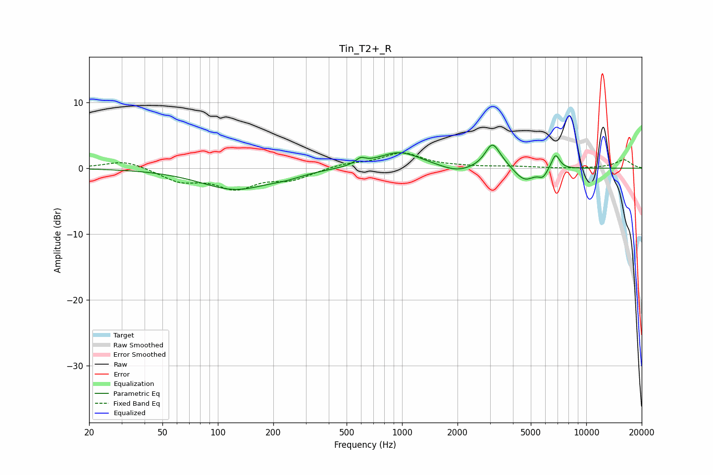

# Tin_T2+_R
See [usage instructions](https://github.com/jaakkopasanen/AutoEq#usage) for more options and info.

### Parametric EQs
Apply preamp of -3.6 dB when using parametric equalizer.

|   # | Type    |   Fc (Hz) |    Q |   Gain (dB) |
|-----|---------|-----------|------|-------------|
|   1 | Peaking |       124 | 0.75 |        -3.2 |
|   2 | Peaking |       236 | 1.61 |        -0.5 |
|   3 | Peaking |       595 | 5.15 |         0.9 |
|   4 | Peaking |       966 | 1.18 |         2.5 |
|   5 | Peaking |      1990 | 1.65 |        -1   |
|   6 | Peaking |      3086 | 3.73 |         3.1 |
|   7 | Peaking |      3339 | 2.12 |         1   |
|   8 | Peaking |      4622 | 2.42 |        -2.2 |
|   9 | Peaking |      5818 | 5.93 |        -1.1 |
|  10 | Peaking |      6814 | 6    |         2.3 |

### Fixed Band EQs
When using fixed band (also called graphic) equalizer, apply preamp of **-2.4 dB** (if available) and set gains manually with these parameters.

|   # | Type    |   Fc (Hz) |    Q |   Gain (dB) |
|-----|---------|-----------|------|-------------|
|   1 | Peaking |        31 | 1.41 |         1.2 |
|   2 | Peaking |        62 | 1.41 |        -1.9 |
|   3 | Peaking |       125 | 1.41 |        -2.8 |
|   4 | Peaking |       250 | 1.41 |        -1.6 |
|   5 | Peaking |       500 | 1.41 |         0.6 |
|   6 | Peaking |      1000 | 1.41 |         2.2 |
|   7 | Peaking |      2000 | 1.41 |         0.2 |
|   8 | Peaking |      4000 | 1.41 |         0.2 |
|   9 | Peaking |      8000 | 1.41 |        -0.1 |
|  10 | Peaking |     16000 | 1.41 |         1.3 |

### Graphs

