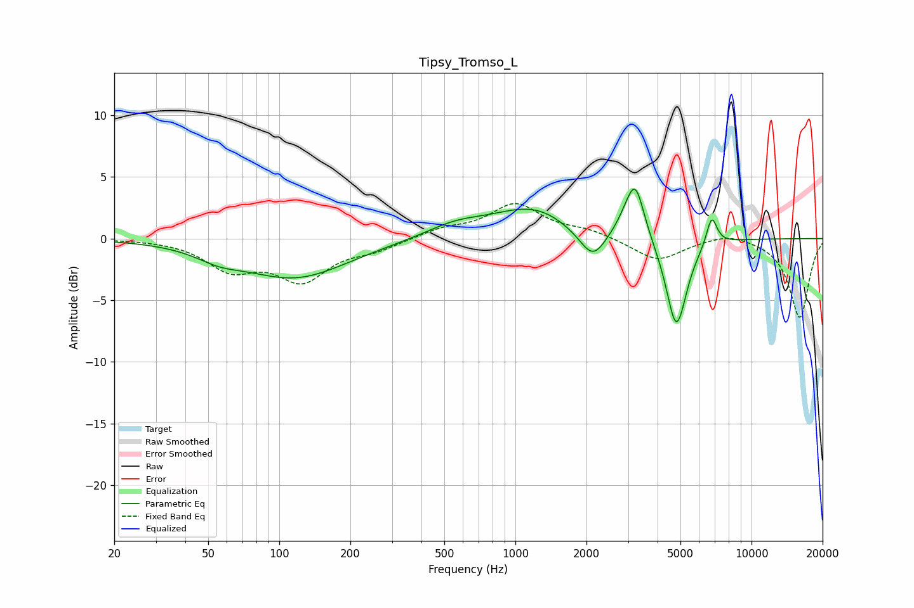

# Tipsy_Tromso_L
See [usage instructions](https://github.com/jaakkopasanen/AutoEq#usage) for more options and info.

### Parametric EQs
Apply preamp of -4.1 dB when using parametric equalizer.

|   # | Type    |   Fc (Hz) |    Q |   Gain (dB) |
|-----|---------|-----------|------|-------------|
|   1 | Peaking |        56 | 1.49 |        -0.8 |
|   2 | Peaking |       116 | 0.63 |        -3.1 |
|   3 | Peaking |       554 | 1.13 |         0.9 |
|   4 | Peaking |      1215 | 0.78 |         2.5 |
|   5 | Peaking |      1667 | 1.84 |        -0.3 |
|   6 | Peaking |      2126 | 2.49 |        -2.6 |
|   7 | Peaking |      2977 | 2.99 |         1   |
|   8 | Peaking |      3227 | 3.76 |         3.9 |
|   9 | Peaking |      4807 | 3.16 |        -7.4 |
|  10 | Peaking |      6781 | 6    |         2.4 |

### Fixed Band EQs
When using fixed band (also called graphic) equalizer, apply preamp of **-2.9 dB** (if available) and set gains manually with these parameters.

|   # | Type    |   Fc (Hz) |    Q |   Gain (dB) |
|-----|---------|-----------|------|-------------|
|   1 | Peaking |        31 | 1.41 |        -0   |
|   2 | Peaking |        62 | 1.41 |        -2.3 |
|   3 | Peaking |       125 | 1.41 |        -3.2 |
|   4 | Peaking |       250 | 1.41 |        -0.8 |
|   5 | Peaking |       500 | 1.41 |         0.7 |
|   6 | Peaking |      1000 | 1.41 |         2.7 |
|   7 | Peaking |      2000 | 1.41 |         0.6 |
|   8 | Peaking |      4000 | 1.41 |        -1.8 |
|   9 | Peaking |      8000 | 1.41 |         0.6 |
|  10 | Peaking |     16000 | 1.41 |        -6.4 |

### Graphs

