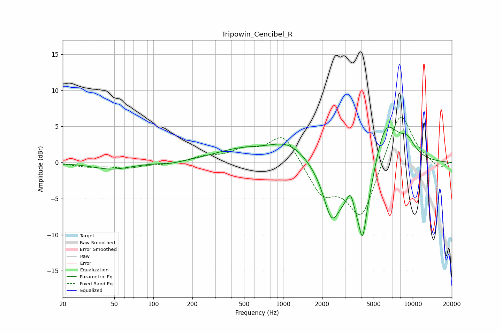

# Tripowin_Cencibel_R
See [usage instructions](https://github.com/jaakkopasanen/AutoEq#usage) for more options and info.

### Parametric EQs
Apply preamp of -5.0 dB when using parametric equalizer.

|   # | Type    |   Fc (Hz) |    Q |   Gain (dB) |
|-----|---------|-----------|------|-------------|
|   1 | Peaking |        48 | 0.96 |        -0.9 |
|   2 | Peaking |       140 | 1.55 |        -0.3 |
|   3 | Peaking |       473 | 0.65 |         1.6 |
|   4 | Peaking |      1117 | 0.96 |         2.6 |
|   5 | Peaking |      2365 | 2.28 |        -6.1 |
|   6 | Peaking |      3311 | 4.89 |         2.7 |
|   7 | Peaking |      4101 | 1.18 |       -10.8 |
|   8 | Peaking |      4106 | 5.95 |        -3.9 |
|   9 | Peaking |      6034 | 1.21 |         9.5 |
|  10 | Peaking |      9141 | 2.25 |         1.8 |

### Fixed Band EQs
When using fixed band (also called graphic) equalizer, apply preamp of **-6.4 dB** (if available) and set gains manually with these parameters.

|   # | Type    |   Fc (Hz) |    Q |   Gain (dB) |
|-----|---------|-----------|------|-------------|
|   1 | Peaking |        31 | 1.41 |        -0.5 |
|   2 | Peaking |        62 | 1.41 |        -0.7 |
|   3 | Peaking |       125 | 1.41 |        -0.3 |
|   4 | Peaking |       250 | 1.41 |         0.7 |
|   5 | Peaking |       500 | 1.41 |         1.5 |
|   6 | Peaking |      1000 | 1.41 |         4.1 |
|   7 | Peaking |      2000 | 1.41 |        -4.2 |
|   8 | Peaking |      4000 | 1.41 |        -7.7 |
|   9 | Peaking |      8000 | 1.41 |         7.6 |
|  10 | Peaking |     16000 | 1.41 |        -1   |

### Graphs

