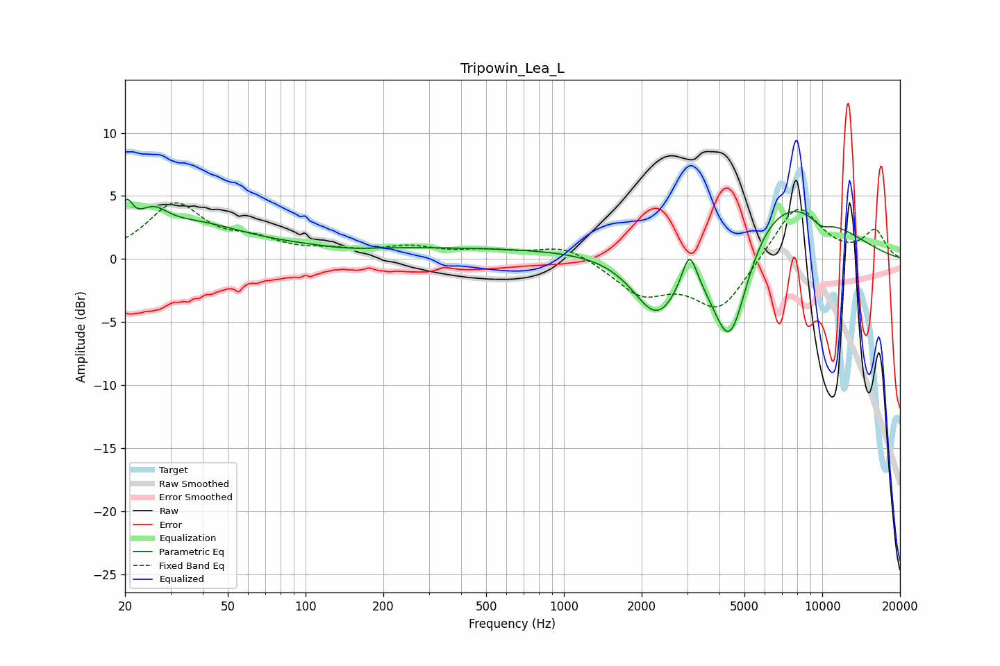

# Tripowin_Lea_L
See [usage instructions](https://github.com/jaakkopasanen/AutoEq#usage) for more options and info.

### Parametric EQs
Apply preamp of -4.8 dB when using parametric equalizer.

|   # | Type    |   Fc (Hz) |    Q |   Gain (dB) |
|-----|---------|-----------|------|-------------|
|   1 | Peaking |        20 | 5.87 |         2.5 |
|   2 | Peaking |        26 | 2.4  |         1.9 |
|   3 | Peaking |        37 | 0.74 |         2.2 |
|   4 | Peaking |       146 | 1.39 |        -0.2 |
|   5 | Peaking |       247 | 0.18 |         0.9 |
|   6 | Peaking |      2297 | 1.45 |        -5.7 |
|   7 | Peaking |      3061 | 4.86 |         3   |
|   8 | Peaking |      4389 | 1.7  |       -11   |
|   9 | Peaking |      5868 | 0.51 |         6.9 |
|  10 | Peaking |      9896 | 2.89 |        -0.9 |

### Fixed Band EQs
When using fixed band (also called graphic) equalizer, apply preamp of **-4.6 dB** (if available) and set gains manually with these parameters.

|   # | Type    |   Fc (Hz) |    Q |   Gain (dB) |
|-----|---------|-----------|------|-------------|
|   1 | Peaking |        31 | 1.41 |         4.2 |
|   2 | Peaking |        62 | 1.41 |         1.2 |
|   3 | Peaking |       125 | 1.41 |         0.5 |
|   4 | Peaking |       250 | 1.41 |         0.8 |
|   5 | Peaking |       500 | 1.41 |         0.5 |
|   6 | Peaking |      1000 | 1.41 |         1.1 |
|   7 | Peaking |      2000 | 1.41 |        -2.6 |
|   8 | Peaking |      4000 | 1.41 |        -4   |
|   9 | Peaking |      8000 | 1.41 |         4.5 |
|  10 | Peaking |     16000 | 1.41 |         2.2 |

### Graphs

