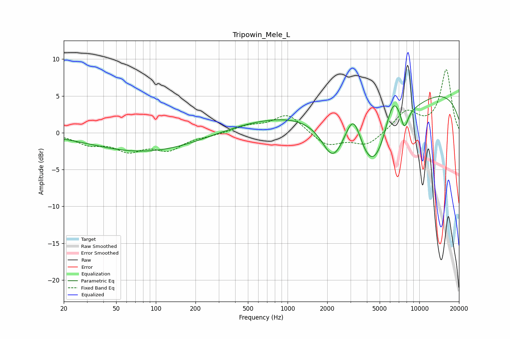

# Tripowin_Mele_L
See [usage instructions](https://github.com/jaakkopasanen/AutoEq#usage) for more options and info.

### Parametric EQs
Apply preamp of -5.0 dB when using parametric equalizer.

|   # | Type    |   Fc (Hz) |    Q |   Gain (dB) |
|-----|---------|-----------|------|-------------|
|   1 | Peaking |        90 | 0.26 |         0.5 |
|   2 | Peaking |       107 | 0.29 |        -3.6 |
|   3 | Peaking |       650 | 0.26 |         2.8 |
|   4 | Peaking |      1027 | 0.2  |        -0.6 |
|   5 | Peaking |      2194 | 1.74 |        -4.5 |
|   6 | Peaking |      3171 | 2.24 |         5.3 |
|   7 | Peaking |      4443 | 0.79 |       -11.6 |
|   8 | Peaking |      6307 | 2.06 |         5.6 |
|   9 | Peaking |      7689 | 4.58 |        -2.8 |
|  10 | Peaking |      9140 | 0.18 |         6.3 |

### Fixed Band EQs
When using fixed band (also called graphic) equalizer, apply preamp of **-8.7 dB** (if available) and set gains manually with these parameters.

|   # | Type    |   Fc (Hz) |    Q |   Gain (dB) |
|-----|---------|-----------|------|-------------|
|   1 | Peaking |        31 | 1.41 |        -1.4 |
|   2 | Peaking |        62 | 1.41 |        -2.1 |
|   3 | Peaking |       125 | 1.41 |        -2.1 |
|   4 | Peaking |       250 | 1.41 |        -0.3 |
|   5 | Peaking |       500 | 1.41 |         0.8 |
|   6 | Peaking |      1000 | 1.41 |         2.5 |
|   7 | Peaking |      2000 | 1.41 |        -1.8 |
|   8 | Peaking |      4000 | 1.41 |        -1.7 |
|   9 | Peaking |      8000 | 1.41 |         2.8 |
|  10 | Peaking |     16000 | 1.41 |         8.5 |

### Graphs

