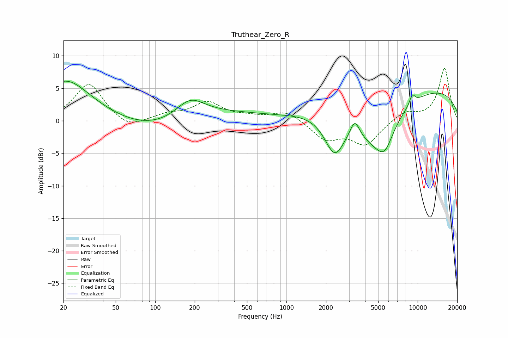

# Truthear_Zero_R
See [usage instructions](https://github.com/jaakkopasanen/AutoEq#usage) for more options and info.

### Parametric EQs
Apply preamp of -6.2 dB when using parametric equalizer.

|   # | Type    |   Fc (Hz) |    Q |   Gain (dB) |
|-----|---------|-----------|------|-------------|
|   1 | Peaking |        21 | 0.9  |         4.1 |
|   2 | Peaking |        74 | 0.18 |         5.1 |
|   3 | Peaking |        91 | 0.37 |        -5.9 |
|   4 | Peaking |       185 | 1.29 |         3   |
|   5 | Peaking |      2333 | 1.78 |        -6.2 |
|   6 | Peaking |      3318 | 4.08 |         2.5 |
|   7 | Peaking |      4856 | 0.84 |        -7.2 |
|   8 | Peaking |      5606 | 2.36 |        -2.9 |
|   9 | Peaking |      8646 | 0.18 |         5.4 |
|  10 | Peaking |      9093 | 5.92 |         1.5 |

### Fixed Band EQs
When using fixed band (also called graphic) equalizer, apply preamp of **-8.1 dB** (if available) and set gains manually with these parameters.

|   # | Type    |   Fc (Hz) |    Q |   Gain (dB) |
|-----|---------|-----------|------|-------------|
|   1 | Peaking |        31 | 1.41 |         5.8 |
|   2 | Peaking |        62 | 1.41 |        -1.5 |
|   3 | Peaking |       125 | 1.41 |         0.9 |
|   4 | Peaking |       250 | 1.41 |         2.7 |
|   5 | Peaking |       500 | 1.41 |         0.5 |
|   6 | Peaking |      1000 | 1.41 |         1.6 |
|   7 | Peaking |      2000 | 1.41 |        -2.8 |
|   8 | Peaking |      4000 | 1.41 |        -3.6 |
|   9 | Peaking |      8000 | 1.41 |         1.4 |
|  10 | Peaking |     16000 | 1.41 |         8.1 |

### Graphs

