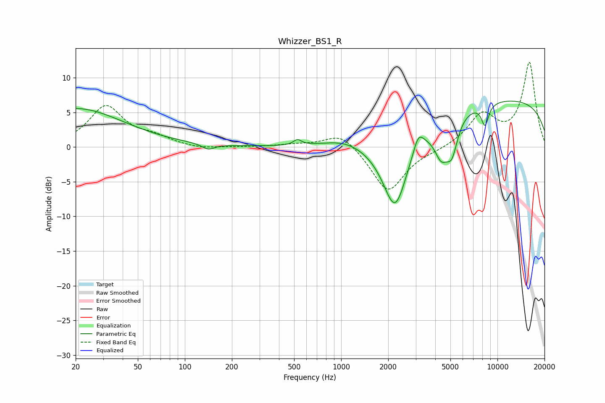

# Whizzer_BS1_R
See [usage instructions](https://github.com/jaakkopasanen/AutoEq#usage) for more options and info.

### Parametric EQs
Apply preamp of -6.7 dB when using parametric equalizer.

|   # | Type    |   Fc (Hz) |    Q |   Gain (dB) |
|-----|---------|-----------|------|-------------|
|   1 | Peaking |        20 | 0.46 |         5.6 |
|   2 | Peaking |       141 | 3.52 |        -0.8 |
|   3 | Peaking |       526 | 5.67 |         0.8 |
|   4 | Peaking |      1035 | 1.15 |         0.8 |
|   5 | Peaking |      2215 | 1.6  |       -11.8 |
|   6 | Peaking |      3119 | 4.28 |         2.5 |
|   7 | Peaking |      4373 | 3.08 |        -4.5 |
|   8 | Peaking |      5115 | 3.74 |        -4.6 |
|   9 | Peaking |      8325 | 5.57 |        -3.1 |
|  10 | Peaking |      9859 | 0.18 |         7   |

### Fixed Band EQs
When using fixed band (also called graphic) equalizer, apply preamp of **-12.3 dB** (if available) and set gains manually with these parameters.

|   # | Type    |   Fc (Hz) |    Q |   Gain (dB) |
|-----|---------|-----------|------|-------------|
|   1 | Peaking |        31 | 1.41 |         5.8 |
|   2 | Peaking |        62 | 1.41 |         1.2 |
|   3 | Peaking |       125 | 1.41 |        -0.3 |
|   4 | Peaking |       250 | 1.41 |        -0   |
|   5 | Peaking |       500 | 1.41 |         0.3 |
|   6 | Peaking |      1000 | 1.41 |         2.3 |
|   7 | Peaking |      2000 | 1.41 |        -6.6 |
|   8 | Peaking |      4000 | 1.41 |        -0.3 |
|   9 | Peaking |      8000 | 1.41 |         4.5 |
|  10 | Peaking |     16000 | 1.41 |        12.1 |

### Graphs

