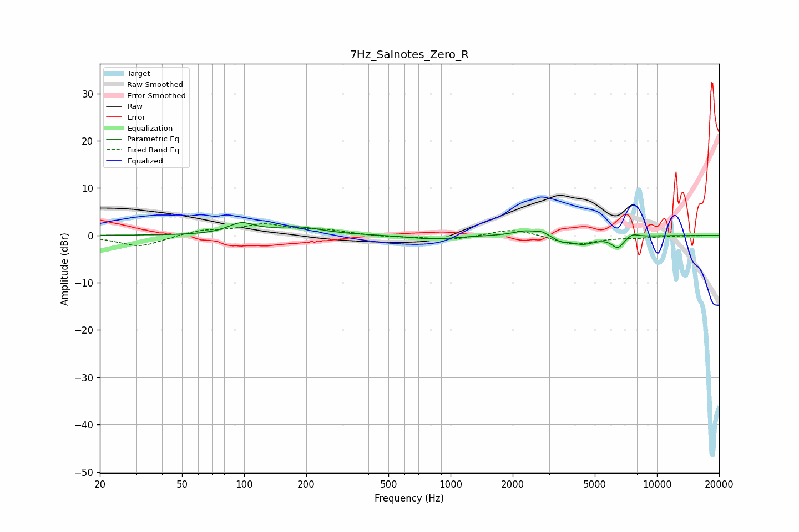

# 7Hz_Salnotes_Zero_R
See [usage instructions](https://github.com/jaakkopasanen/AutoEq#usage) for more options and info.

### Parametric EQs
Apply preamp of -2.8 dB when using parametric equalizer.

|   # | Type    |   Fc (Hz) |    Q |   Gain (dB) |
|-----|---------|-----------|------|-------------|
|   1 | Peaking |        97 | 2.22 |         2.3 |
|   2 | Peaking |       181 | 1.21 |         1.6 |
|   3 | Peaking |       808 | 1.33 |        -0.7 |
|   4 | Peaking |       939 | 1.3  |        -0.1 |
|   5 | Peaking |      2330 | 2.31 |         1.2 |
|   6 | Peaking |      2774 | 6    |         0.6 |
|   7 | Peaking |      3421 | 4.83 |        -0.8 |
|   8 | Peaking |      4338 | 2.21 |        -1.8 |
|   9 | Peaking |      6464 | 4.52 |        -2.4 |
|  10 | Peaking |      7589 | 4.8  |         0.8 |

### Fixed Band EQs
When using fixed band (also called graphic) equalizer, apply preamp of **-2.5 dB** (if available) and set gains manually with these parameters.

|   # | Type    |   Fc (Hz) |    Q |   Gain (dB) |
|-----|---------|-----------|------|-------------|
|   1 | Peaking |        31 | 1.41 |        -2.4 |
|   2 | Peaking |        62 | 1.41 |         1.1 |
|   3 | Peaking |       125 | 1.41 |         2.2 |
|   4 | Peaking |       250 | 1.41 |         0.9 |
|   5 | Peaking |       500 | 1.41 |        -0.3 |
|   6 | Peaking |      1000 | 1.41 |        -1   |
|   7 | Peaking |      2000 | 1.41 |         1.5 |
|   8 | Peaking |      4000 | 1.41 |        -2   |
|   9 | Peaking |      8000 | 1.41 |        -0.4 |
|  10 | Peaking |     16000 | 1.41 |        -0   |

### Graphs

