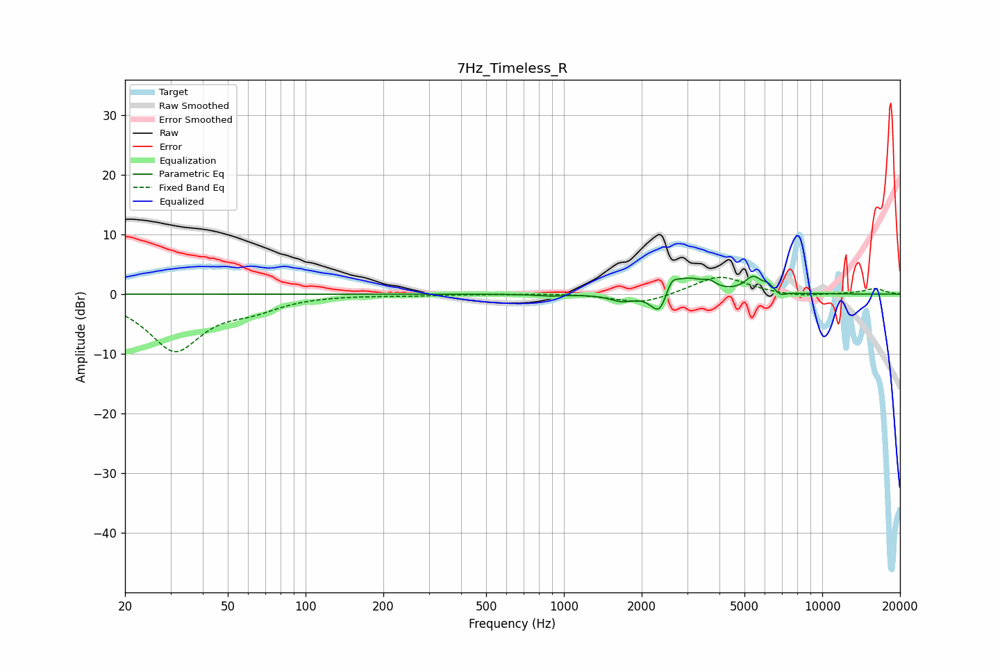

# 7Hz_Timeless_R
See [usage instructions](https://github.com/jaakkopasanen/AutoEq#usage) for more options and info.

### Parametric EQs
Apply preamp of -3.1 dB when using parametric equalizer.

|   # | Type    |   Fc (Hz) |    Q |   Gain (dB) |
|-----|---------|-----------|------|-------------|
|   1 | Peaking |       892 | 2.81 |        -0.3 |
|   2 | Peaking |      1678 | 2.98 |        -1.2 |
|   3 | Peaking |      2346 | 3.88 |        -3.4 |
|   4 | Peaking |      2353 | 6    |        -0.9 |
|   5 | Peaking |      2605 | 6    |         2.4 |
|   6 | Peaking |      3014 | 2.23 |         2.7 |
|   7 | Peaking |      3663 | 6    |         0.9 |
|   8 | Peaking |      5402 | 4.27 |         2.6 |
|   9 | Peaking |      6210 | 6    |         1   |
|  10 | Peaking |      6873 | 6    |        -0.8 |

### Fixed Band EQs
When using fixed band (also called graphic) equalizer, apply preamp of **-2.9 dB** (if available) and set gains manually with these parameters.

|   # | Type    |   Fc (Hz) |    Q |   Gain (dB) |
|-----|---------|-----------|------|-------------|
|   1 | Peaking |        31 | 1.41 |        -9.3 |
|   2 | Peaking |        62 | 1.41 |        -1.9 |
|   3 | Peaking |       125 | 1.41 |        -0   |
|   4 | Peaking |       250 | 1.41 |        -0.2 |
|   5 | Peaking |       500 | 1.41 |         0   |
|   6 | Peaking |      1000 | 1.41 |         0.1 |
|   7 | Peaking |      2000 | 1.41 |        -1.7 |
|   8 | Peaking |      4000 | 1.41 |         3.2 |
|   9 | Peaking |      8000 | 1.41 |        -0.5 |
|  10 | Peaking |     16000 | 1.41 |         0.9 |

### Graphs

