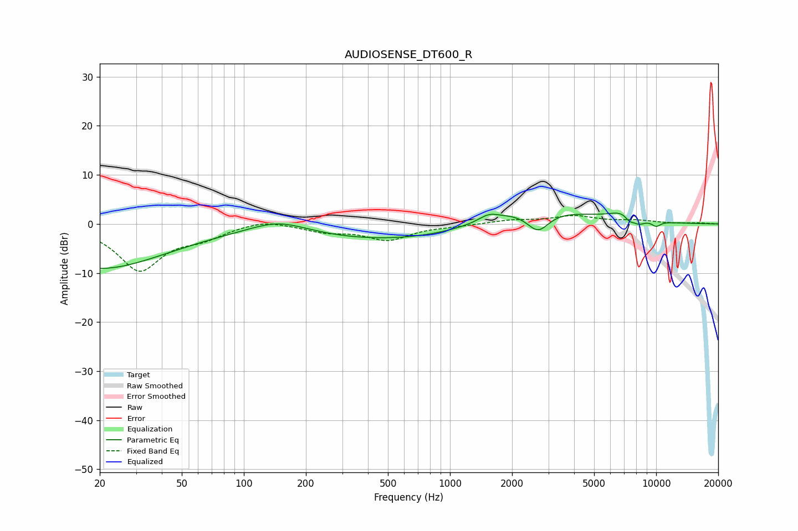

# AUDIOSENSE_DT600_R
See [usage instructions](https://github.com/jaakkopasanen/AutoEq#usage) for more options and info.

### Parametric EQs
Apply preamp of -2.3 dB when using parametric equalizer.

|   # | Type    |   Fc (Hz) |    Q |   Gain (dB) |
|-----|---------|-----------|------|-------------|
|   1 | Peaking |        20 | 0.42 |        -9.1 |
|   2 | Peaking |       147 | 1.02 |         2.5 |
|   3 | Peaking |       591 | 0.29 |        -3.6 |
|   4 | Peaking |      1541 | 3.07 |         1.2 |
|   5 | Peaking |      2384 | 0.57 |         4.6 |
|   6 | Peaking |      2674 | 2.53 |        -4.4 |
|   7 | Peaking |      6922 | 2.02 |         1.7 |
|   8 | Peaking |      7425 | 6    |        -1.3 |
|   9 | Peaking |      8225 | 4.5  |        -1.2 |
|  10 | Peaking |     10000 | 5.65 |        -1   |

### Fixed Band EQs
When using fixed band (also called graphic) equalizer, apply preamp of **-1.8 dB** (if available) and set gains manually with these parameters.

|   # | Type    |   Fc (Hz) |    Q |   Gain (dB) |
|-----|---------|-----------|------|-------------|
|   1 | Peaking |        31 | 1.41 |        -9.3 |
|   2 | Peaking |        62 | 1.41 |        -2.2 |
|   3 | Peaking |       125 | 1.41 |         1.1 |
|   4 | Peaking |       250 | 1.41 |        -1.4 |
|   5 | Peaking |       500 | 1.41 |        -3.1 |
|   6 | Peaking |      1000 | 1.41 |        -0.3 |
|   7 | Peaking |      2000 | 1.41 |         0.7 |
|   8 | Peaking |      4000 | 1.41 |         1.5 |
|   9 | Peaking |      8000 | 1.41 |         0.6 |
|  10 | Peaking |     16000 | 1.41 |         0.2 |

### Graphs

