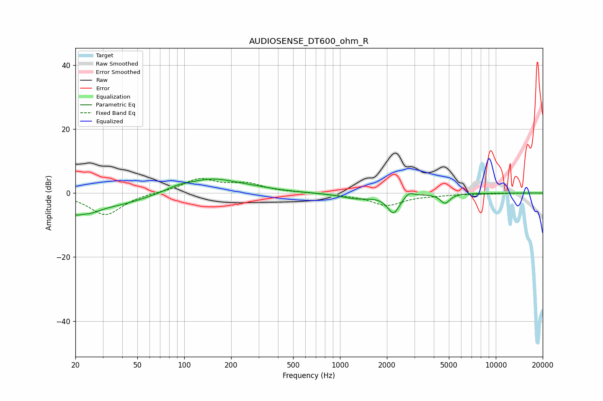

# AUDIOSENSE_DT600_ohm_R
See [usage instructions](https://github.com/jaakkopasanen/AutoEq#usage) for more options and info.

### Parametric EQs
Apply preamp of -4.5 dB when using parametric equalizer.

|   # | Type    |   Fc (Hz) |    Q |   Gain (dB) |
|-----|---------|-----------|------|-------------|
|   1 | Peaking |        20 | 4.97 |        -1.9 |
|   2 | Peaking |        23 | 1.49 |        -4.5 |
|   3 | Peaking |        39 | 0.77 |        -2.8 |
|   4 | Peaking |        92 | 1.88 |         1.2 |
|   5 | Peaking |       150 | 0.87 |         4.2 |
|   6 | Peaking |       276 | 1.02 |         0.8 |
|   7 | Peaking |      1272 | 1.44 |        -1.6 |
|   8 | Peaking |      2206 | 3.54 |        -5.9 |
|   9 | Peaking |      2761 | 4.72 |         1.6 |
|  10 | Peaking |      4721 | 4.62 |        -3   |

### Fixed Band EQs
When using fixed band (also called graphic) equalizer, apply preamp of **-4.7 dB** (if available) and set gains manually with these parameters.

|   # | Type    |   Fc (Hz) |    Q |   Gain (dB) |
|-----|---------|-----------|------|-------------|
|   1 | Peaking |        31 | 1.41 |        -6.9 |
|   2 | Peaking |        62 | 1.41 |         0.2 |
|   3 | Peaking |       125 | 1.41 |         4.3 |
|   4 | Peaking |       250 | 1.41 |         2.7 |
|   5 | Peaking |       500 | 1.41 |         0.1 |
|   6 | Peaking |      1000 | 1.41 |        -0.3 |
|   7 | Peaking |      2000 | 1.41 |        -3.7 |
|   8 | Peaking |      4000 | 1.41 |        -0.5 |
|   9 | Peaking |      8000 | 1.41 |        -0.2 |
|  10 | Peaking |     16000 | 1.41 |         0   |

### Graphs

