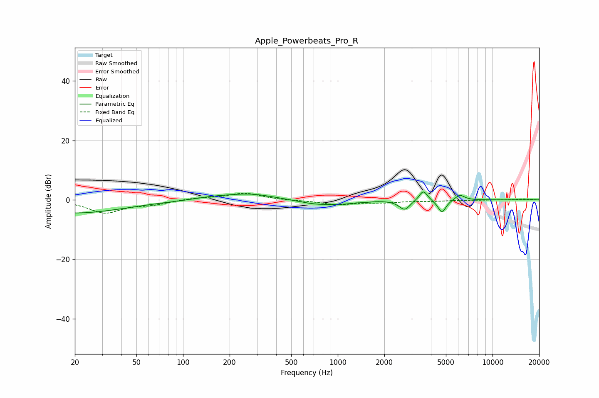

# Apple_Powerbeats_Pro_R
See [usage instructions](https://github.com/jaakkopasanen/AutoEq#usage) for more options and info.

### Parametric EQs
Apply preamp of -2.8 dB when using parametric equalizer.

|   # | Type    |   Fc (Hz) |    Q |   Gain (dB) |
|-----|---------|-----------|------|-------------|
|   1 | Peaking |        20 | 0.44 |        -4.4 |
|   2 | Peaking |       153 | 1.27 |         0.7 |
|   3 | Peaking |       269 | 0.9  |         2   |
|   4 | Peaking |       742 | 1.17 |        -1.6 |
|   5 | Peaking |      1083 | 1.97 |        -0.7 |
|   6 | Peaking |      1500 | 4.07 |        -0.3 |
|   7 | Peaking |      2703 | 4    |        -3.3 |
|   8 | Peaking |      3573 | 5.3  |         3.6 |
|   9 | Peaking |      4713 | 5.24 |        -4.4 |
|  10 | Peaking |      6145 | 4.46 |         1.9 |

### Fixed Band EQs
When using fixed band (also called graphic) equalizer, apply preamp of **-2.3 dB** (if available) and set gains manually with these parameters.

|   # | Type    |   Fc (Hz) |    Q |   Gain (dB) |
|-----|---------|-----------|------|-------------|
|   1 | Peaking |        31 | 1.41 |        -4.3 |
|   2 | Peaking |        62 | 1.41 |        -1.3 |
|   3 | Peaking |       125 | 1.41 |         0.6 |
|   4 | Peaking |       250 | 1.41 |         2.3 |
|   5 | Peaking |       500 | 1.41 |        -0.2 |
|   6 | Peaking |      1000 | 1.41 |        -1.6 |
|   7 | Peaking |      2000 | 1.41 |        -0.8 |
|   8 | Peaking |      4000 | 1.41 |        -0.4 |
|   9 | Peaking |      8000 | 1.41 |        -0   |
|  10 | Peaking |     16000 | 1.41 |         0.3 |

### Graphs

