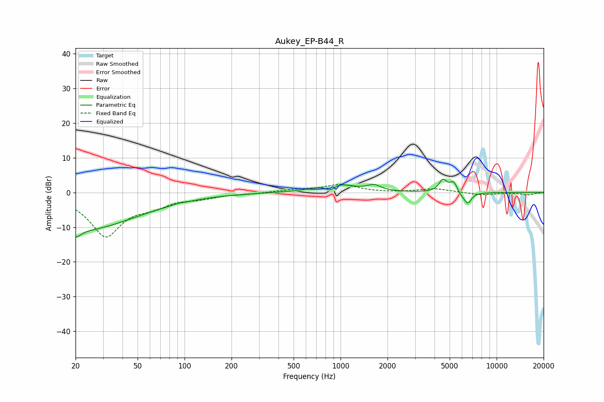

# Aukey_EP-B44_R
See [usage instructions](https://github.com/jaakkopasanen/AutoEq#usage) for more options and info.

### Parametric EQs
Apply preamp of -4.0 dB when using parametric equalizer.

|   # | Type    |   Fc (Hz) |    Q |   Gain (dB) |
|-----|---------|-----------|------|-------------|
|   1 | Peaking |        20 | 4.09 |        -2.7 |
|   2 | Peaking |        24 | 0.42 |       -10.4 |
|   3 | Peaking |        91 | 5.97 |         0.2 |
|   4 | Peaking |       859 | 3.95 |        -2.3 |
|   5 | Peaking |       909 | 1.43 |         3.2 |
|   6 | Peaking |      1636 | 3.27 |         1.6 |
|   7 | Peaking |      4522 | 5.71 |         3.4 |
|   8 | Peaking |      5314 | 5.15 |         3.6 |
|   9 | Peaking |      5852 | 3.14 |        -1.5 |
|  10 | Peaking |      6535 | 5.97 |        -2.8 |

### Fixed Band EQs
When using fixed band (also called graphic) equalizer, apply preamp of **-2.4 dB** (if available) and set gains manually with these parameters.

|   # | Type    |   Fc (Hz) |    Q |   Gain (dB) |
|-----|---------|-----------|------|-------------|
|   1 | Peaking |        31 | 1.41 |       -12.3 |
|   2 | Peaking |        62 | 1.41 |        -2.7 |
|   3 | Peaking |       125 | 1.41 |        -1.2 |
|   4 | Peaking |       250 | 1.41 |        -0.3 |
|   5 | Peaking |       500 | 1.41 |         0.7 |
|   6 | Peaking |      1000 | 1.41 |         2.2 |
|   7 | Peaking |      2000 | 1.41 |        -0.1 |
|   8 | Peaking |      4000 | 1.41 |         1.1 |
|   9 | Peaking |      8000 | 1.41 |        -0.7 |
|  10 | Peaking |     16000 | 1.41 |        -0.7 |

### Graphs

