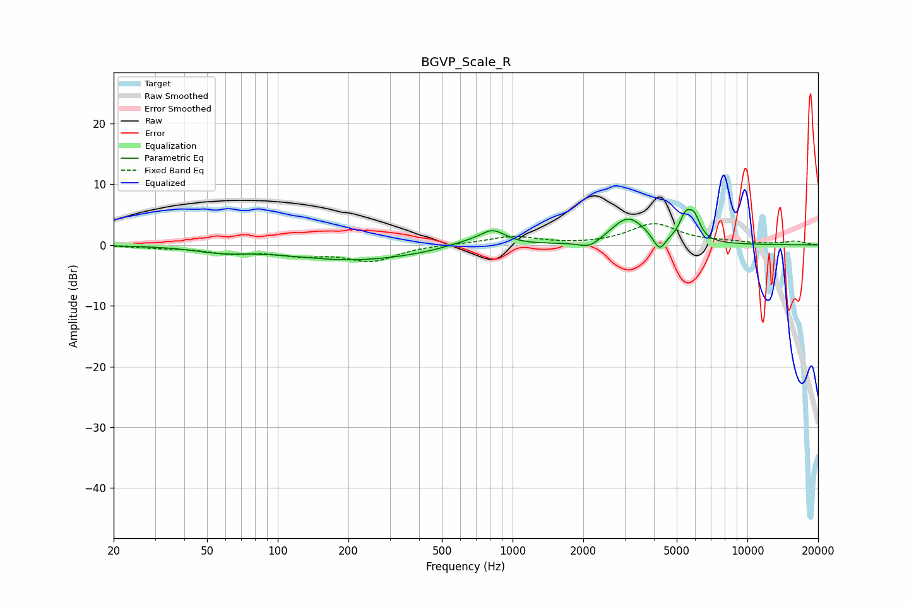

# BGVP_Scale_R
See [usage instructions](https://github.com/jaakkopasanen/AutoEq#usage) for more options and info.

### Parametric EQs
Apply preamp of -5.9 dB when using parametric equalizer.

|   # | Type    |   Fc (Hz) |    Q |   Gain (dB) |
|-----|---------|-----------|------|-------------|
|   1 | Peaking |        57 | 1.31 |        -0.8 |
|   2 | Peaking |       214 | 0.49 |        -2.5 |
|   3 | Peaking |       622 | 1.5  |         0.8 |
|   4 | Peaking |       822 | 2.53 |         2.4 |
|   5 | Peaking |      2129 | 2.99 |        -1.4 |
|   6 | Peaking |      3105 | 1.91 |         4.5 |
|   7 | Peaking |      4090 | 5.51 |        -0.8 |
|   8 | Peaking |      4261 | 6    |        -2   |
|   9 | Peaking |      5453 | 5.32 |         3.6 |
|  10 | Peaking |      5944 | 5.43 |         3.3 |

### Fixed Band EQs
When using fixed band (also called graphic) equalizer, apply preamp of **-3.6 dB** (if available) and set gains manually with these parameters.

|   # | Type    |   Fc (Hz) |    Q |   Gain (dB) |
|-----|---------|-----------|------|-------------|
|   1 | Peaking |        31 | 1.41 |        -0.4 |
|   2 | Peaking |        62 | 1.41 |        -1.2 |
|   3 | Peaking |       125 | 1.41 |        -1.4 |
|   4 | Peaking |       250 | 1.41 |        -2.5 |
|   5 | Peaking |       500 | 1.41 |         0.1 |
|   6 | Peaking |      1000 | 1.41 |         1.4 |
|   7 | Peaking |      2000 | 1.41 |        -0.1 |
|   8 | Peaking |      4000 | 1.41 |         3.4 |
|   9 | Peaking |      8000 | 1.41 |         0.4 |
|  10 | Peaking |     16000 | 1.41 |         0.6 |

### Graphs

