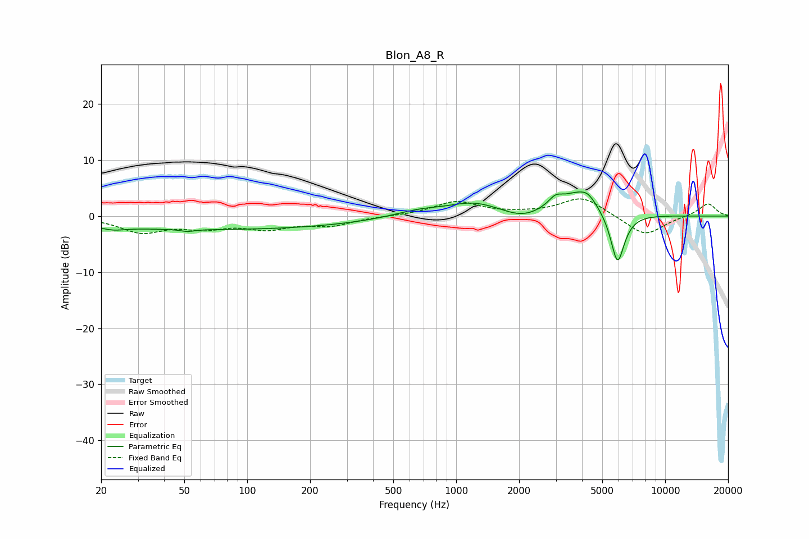

# Blon_A8_R
See [usage instructions](https://github.com/jaakkopasanen/AutoEq#usage) for more options and info.

### Parametric EQs
Apply preamp of -4.4 dB when using parametric equalizer.

|   # | Type    |   Fc (Hz) |    Q |   Gain (dB) |
|-----|---------|-----------|------|-------------|
|   1 | Peaking |        23 | 2.64 |        -0.6 |
|   2 | Peaking |        52 | 4.71 |        -0.4 |
|   3 | Peaking |        70 | 0.18 |        -2.4 |
|   4 | Peaking |       663 | 1.13 |         1.2 |
|   5 | Peaking |      1217 | 1.16 |         2.2 |
|   6 | Peaking |      2079 | 1.64 |        -1.3 |
|   7 | Peaking |      2983 | 4.21 |         1.5 |
|   8 | Peaking |      3916 | 1.4  |         4.4 |
|   9 | Peaking |      4268 | 4.38 |         0.9 |
|  10 | Peaking |      5912 | 3.99 |        -9.6 |

### Fixed Band EQs
When using fixed band (also called graphic) equalizer, apply preamp of **-3.2 dB** (if available) and set gains manually with these parameters.

|   # | Type    |   Fc (Hz) |    Q |   Gain (dB) |
|-----|---------|-----------|------|-------------|
|   1 | Peaking |        31 | 1.41 |        -2.7 |
|   2 | Peaking |        62 | 1.41 |        -1.7 |
|   3 | Peaking |       125 | 1.41 |        -2   |
|   4 | Peaking |       250 | 1.41 |        -1.5 |
|   5 | Peaking |       500 | 1.41 |         0   |
|   6 | Peaking |      1000 | 1.41 |         2.5 |
|   7 | Peaking |      2000 | 1.41 |         0.3 |
|   8 | Peaking |      4000 | 1.41 |         3.4 |
|   9 | Peaking |      8000 | 1.41 |        -3.6 |
|  10 | Peaking |     16000 | 1.41 |         2.3 |

### Graphs

