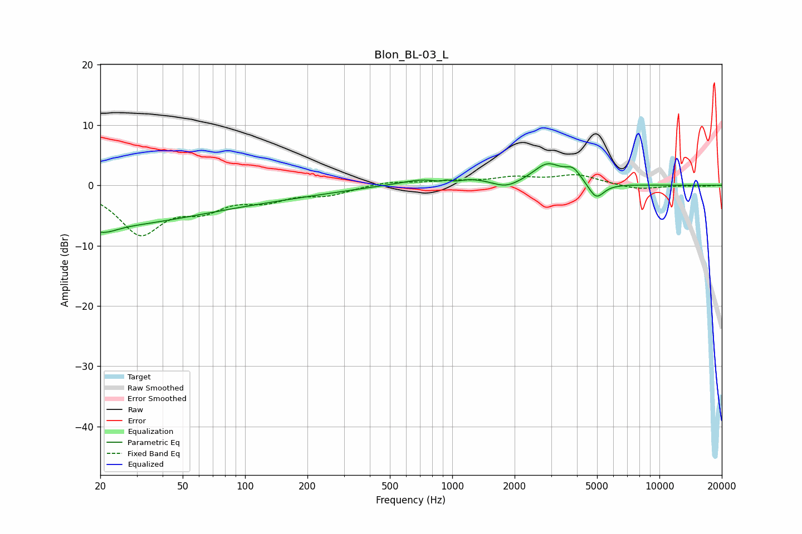

# Blon_BL-03_L
See [usage instructions](https://github.com/jaakkopasanen/AutoEq#usage) for more options and info.

### Parametric EQs
Apply preamp of -3.7 dB when using parametric equalizer.

|   # | Type    |   Fc (Hz) |    Q |   Gain (dB) |
|-----|---------|-----------|------|-------------|
|   1 | Peaking |        20 | 2.08 |        -1.6 |
|   2 | Peaking |        20 | 0.34 |        -4   |
|   3 | Peaking |        51 | 0.21 |        -2.6 |
|   4 | Peaking |       939 | 1.09 |         3.1 |
|   5 | Peaking |       940 | 5.93 |         0.8 |
|   6 | Peaking |       943 | 2.11 |        -2.8 |
|   7 | Peaking |      1811 | 2.23 |        -1.2 |
|   8 | Peaking |      2881 | 2.05 |         3.3 |
|   9 | Peaking |      3834 | 3.55 |         2   |
|  10 | Peaking |      4950 | 3.71 |        -2.7 |

### Fixed Band EQs
When using fixed band (also called graphic) equalizer, apply preamp of **-1.9 dB** (if available) and set gains manually with these parameters.

|   # | Type    |   Fc (Hz) |    Q |   Gain (dB) |
|-----|---------|-----------|------|-------------|
|   1 | Peaking |        31 | 1.41 |        -7.7 |
|   2 | Peaking |        62 | 1.41 |        -3.2 |
|   3 | Peaking |       125 | 1.41 |        -2.1 |
|   4 | Peaking |       250 | 1.41 |        -1.4 |
|   5 | Peaking |       500 | 1.41 |         0.6 |
|   6 | Peaking |      1000 | 1.41 |         0.6 |
|   7 | Peaking |      2000 | 1.41 |         1.2 |
|   8 | Peaking |      4000 | 1.41 |         1.6 |
|   9 | Peaking |      8000 | 1.41 |        -0.7 |
|  10 | Peaking |     16000 | 1.41 |        -0.1 |

### Graphs

