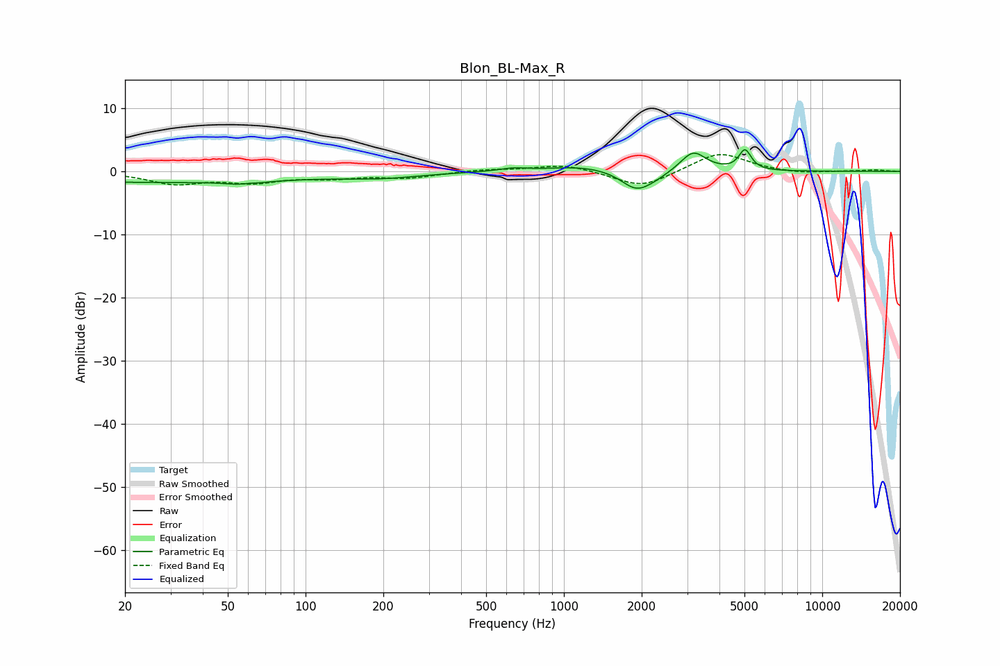

# Blon_BL-Max_R
See [usage instructions](https://github.com/jaakkopasanen/AutoEq#usage) for more options and info.

### Parametric EQs
Apply preamp of -3.6 dB when using parametric equalizer.

|   # | Type    |   Fc (Hz) |    Q |   Gain (dB) |
|-----|---------|-----------|------|-------------|
|   1 | Peaking |        25 | 0.22 |        -1.7 |
|   2 | Peaking |        59 | 2.91 |        -1.9 |
|   3 | Peaking |        59 | 3.5  |         1.5 |
|   4 | Peaking |       199 | 0.93 |        -0.7 |
|   5 | Peaking |       635 | 2.59 |         0.5 |
|   6 | Peaking |      1185 | 1.1  |         0.9 |
|   7 | Peaking |      1893 | 2.51 |        -2.6 |
|   8 | Peaking |      2192 | 2.11 |        -1.1 |
|   9 | Peaking |      3166 | 2.85 |         3.3 |
|  10 | Peaking |      5024 | 6    |         3.2 |

### Fixed Band EQs
When using fixed band (also called graphic) equalizer, apply preamp of **-2.7 dB** (if available) and set gains manually with these parameters.

|   # | Type    |   Fc (Hz) |    Q |   Gain (dB) |
|-----|---------|-----------|------|-------------|
|   1 | Peaking |        31 | 1.41 |        -1.8 |
|   2 | Peaking |        62 | 1.41 |        -1.5 |
|   3 | Peaking |       125 | 1.41 |        -0.9 |
|   4 | Peaking |       250 | 1.41 |        -0.9 |
|   5 | Peaking |       500 | 1.41 |         0.3 |
|   6 | Peaking |      1000 | 1.41 |         1.1 |
|   7 | Peaking |      2000 | 1.41 |        -2.7 |
|   8 | Peaking |      4000 | 1.41 |         3.1 |
|   9 | Peaking |      8000 | 1.41 |        -0.4 |
|  10 | Peaking |     16000 | 1.41 |         0.2 |

### Graphs

