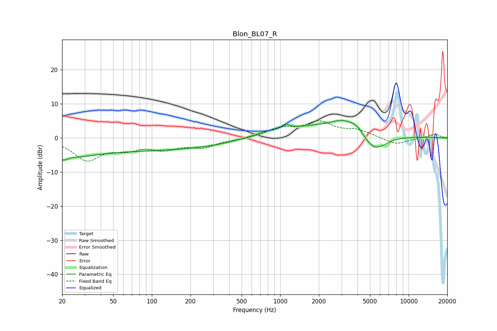

# Blon_BL07_R
See [usage instructions](https://github.com/jaakkopasanen/AutoEq#usage) for more options and info.

### Parametric EQs
Apply preamp of -5.2 dB when using parametric equalizer.

|   # | Type    |   Fc (Hz) |    Q |   Gain (dB) |
|-----|---------|-----------|------|-------------|
|   1 | Peaking |        20 | 4.92 |        -1.2 |
|   2 | Peaking |        21 | 0.7  |        -3.1 |
|   3 | Peaking |        87 | 0.19 |        -3.6 |
|   4 | Peaking |       858 | 0.89 |         1.6 |
|   5 | Peaking |      1124 | 5.62 |         1   |
|   6 | Peaking |      2889 | 0.4  |         4   |
|   7 | Peaking |      3138 | 1.62 |         2.3 |
|   8 | Peaking |      3982 | 2.82 |         1.9 |
|   9 | Peaking |      5375 | 1.3  |        -6.4 |
|  10 | Peaking |     10000 | 5.99 |        -0.1 |

### Fixed Band EQs
When using fixed band (also called graphic) equalizer, apply preamp of **-5.1 dB** (if available) and set gains manually with these parameters.

|   # | Type    |   Fc (Hz) |    Q |   Gain (dB) |
|-----|---------|-----------|------|-------------|
|   1 | Peaking |        31 | 1.41 |        -6.2 |
|   2 | Peaking |        62 | 1.41 |        -2.6 |
|   3 | Peaking |       125 | 1.41 |        -2.8 |
|   4 | Peaking |       250 | 1.41 |        -2.4 |
|   5 | Peaking |       500 | 1.41 |        -0.4 |
|   6 | Peaking |      1000 | 1.41 |         2.6 |
|   7 | Peaking |      2000 | 1.41 |         4.3 |
|   8 | Peaking |      4000 | 1.41 |         2   |
|   9 | Peaking |      8000 | 1.41 |        -2   |
|  10 | Peaking |     16000 | 1.41 |         1.1 |

### Graphs

