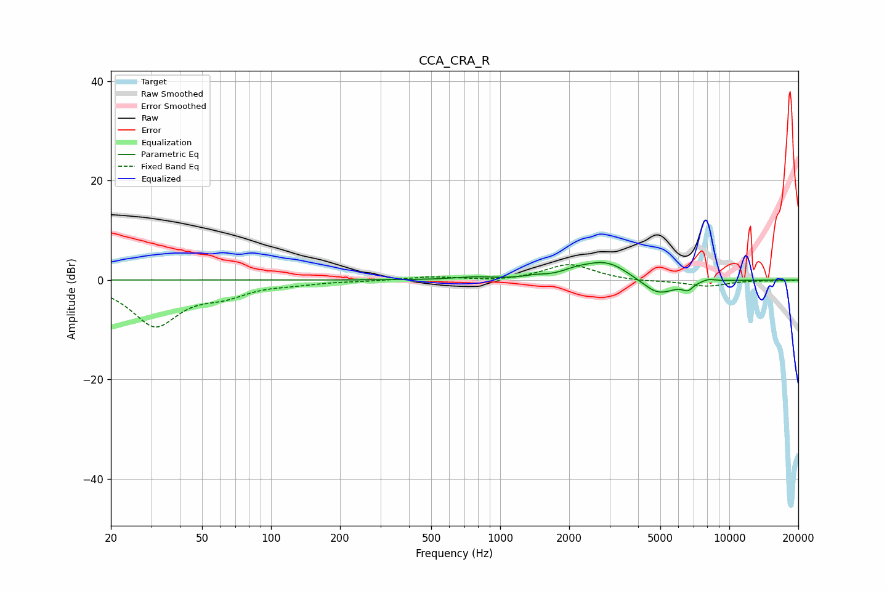

# CCA_CRA_R
See [usage instructions](https://github.com/jaakkopasanen/AutoEq#usage) for more options and info.

### Parametric EQs
Apply preamp of -3.6 dB when using parametric equalizer.

|   # | Type    |   Fc (Hz) |    Q |   Gain (dB) |
|-----|---------|-----------|------|-------------|
|   1 | Peaking |       764 | 1.73 |         0.5 |
|   2 | Peaking |      1410 | 3.42 |         0.4 |
|   3 | Peaking |      2134 | 2.43 |         0.9 |
|   4 | Peaking |      2570 | 1.68 |        -0.3 |
|   5 | Peaking |      2764 | 1.54 |         3.5 |
|   6 | Peaking |      3266 | 2.5  |         0.7 |
|   7 | Peaking |      4052 | 2.74 |         0.3 |
|   8 | Peaking |      4881 | 1.84 |        -3.3 |
|   9 | Peaking |      6586 | 6    |        -1.4 |
|  10 | Peaking |      8092 | 4.19 |         0.5 |

### Fixed Band EQs
When using fixed band (also called graphic) equalizer, apply preamp of **-3.2 dB** (if available) and set gains manually with these parameters.

|   # | Type    |   Fc (Hz) |    Q |   Gain (dB) |
|-----|---------|-----------|------|-------------|
|   1 | Peaking |        31 | 1.41 |        -9   |
|   2 | Peaking |        62 | 1.41 |        -2.3 |
|   3 | Peaking |       125 | 1.41 |        -0.6 |
|   4 | Peaking |       250 | 1.41 |        -0.1 |
|   5 | Peaking |       500 | 1.41 |         0.7 |
|   6 | Peaking |      1000 | 1.41 |        -0.3 |
|   7 | Peaking |      2000 | 1.41 |         3.2 |
|   8 | Peaking |      4000 | 1.41 |        -0.3 |
|   9 | Peaking |      8000 | 1.41 |        -1.3 |
|  10 | Peaking |     16000 | 1.41 |        -0.1 |

### Graphs

