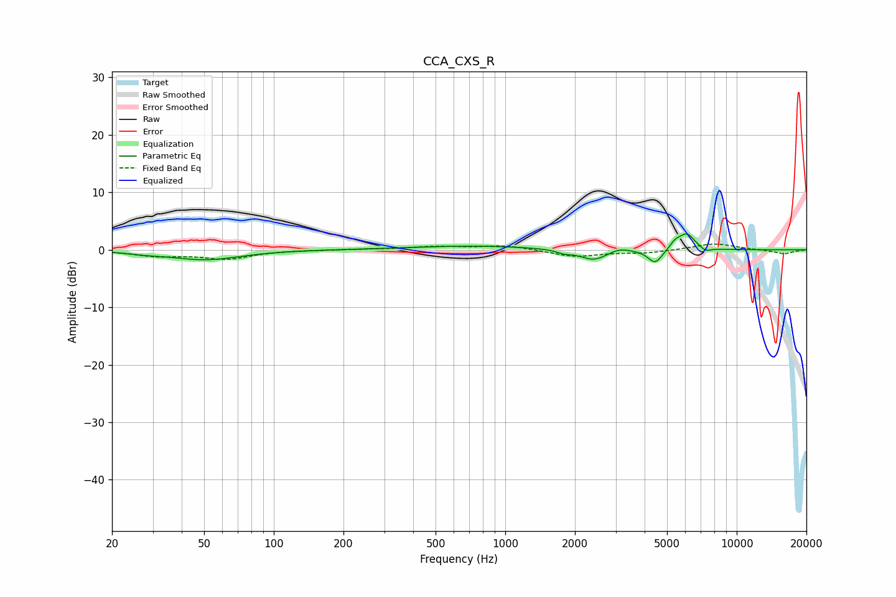

# CCA_CXS_R
See [usage instructions](https://github.com/jaakkopasanen/AutoEq#usage) for more options and info.

### Parametric EQs
Apply preamp of -2.9 dB when using parametric equalizer.

|   # | Type    |   Fc (Hz) |    Q |   Gain (dB) |
|-----|---------|-----------|------|-------------|
|   1 | Peaking |        28 | 1.81 |        -0.3 |
|   2 | Peaking |        51 | 0.96 |        -1.7 |
|   3 | Peaking |       734 | 0.51 |         0.7 |
|   4 | Peaking |      1793 | 4.55 |        -0.5 |
|   5 | Peaking |      2414 | 2.35 |        -1.9 |
|   6 | Peaking |      3096 | 3.24 |         0.7 |
|   7 | Peaking |      4444 | 4.55 |        -2.5 |
|   8 | Peaking |      5428 | 6    |         1.1 |
|   9 | Peaking |      6089 | 4.08 |         2.7 |
|  10 | Peaking |      7351 | 5.99 |        -0.7 |

### Fixed Band EQs
When using fixed band (also called graphic) equalizer, apply preamp of **-1.1 dB** (if available) and set gains manually with these parameters.

|   # | Type    |   Fc (Hz) |    Q |   Gain (dB) |
|-----|---------|-----------|------|-------------|
|   1 | Peaking |        31 | 1.41 |        -1   |
|   2 | Peaking |        62 | 1.41 |        -1.5 |
|   3 | Peaking |       125 | 1.41 |         0   |
|   4 | Peaking |       250 | 1.41 |         0.1 |
|   5 | Peaking |       500 | 1.41 |         0.5 |
|   6 | Peaking |      1000 | 1.41 |         0.8 |
|   7 | Peaking |      2000 | 1.41 |        -1.2 |
|   8 | Peaking |      4000 | 1.41 |        -0.5 |
|   9 | Peaking |      8000 | 1.41 |         1.1 |
|  10 | Peaking |     16000 | 1.41 |        -0.7 |

### Graphs

