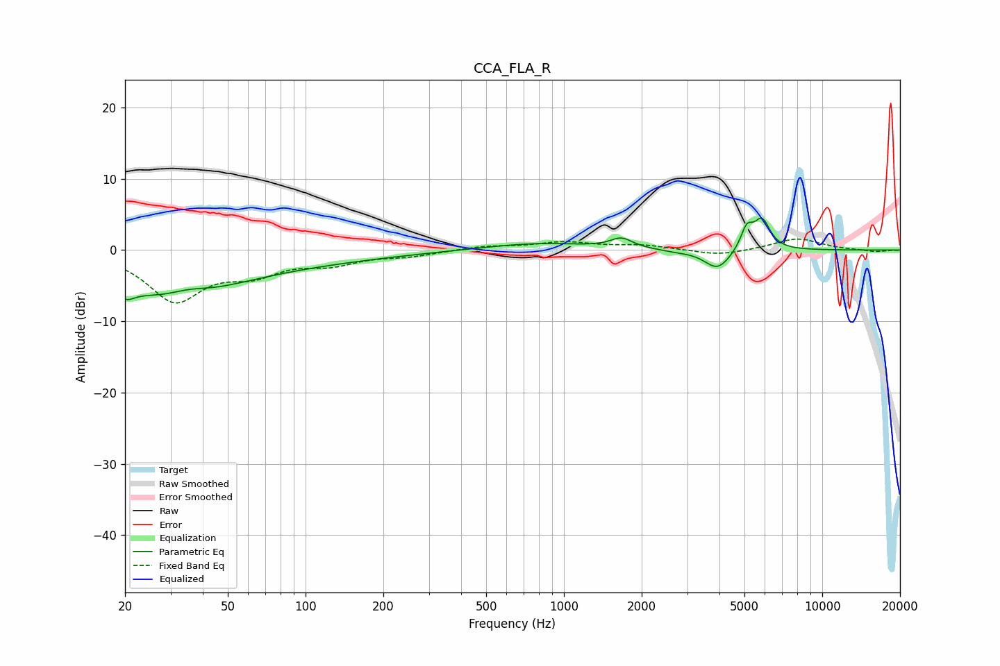

# CCA_FLA_R
See [usage instructions](https://github.com/jaakkopasanen/AutoEq#usage) for more options and info.

### Parametric EQs
Apply preamp of -4.6 dB when using parametric equalizer.

|   # | Type    |   Fc (Hz) |    Q |   Gain (dB) |
|-----|---------|-----------|------|-------------|
|   1 | Peaking |        20 | 4.25 |        -1.5 |
|   2 | Peaking |        30 | 0.59 |        -4.8 |
|   3 | Peaking |        35 | 1.79 |         1.1 |
|   4 | Peaking |        41 | 0.21 |        -1.9 |
|   5 | Peaking |       795 | 0.69 |         1   |
|   6 | Peaking |      1670 | 3.33 |         1.4 |
|   7 | Peaking |      2704 | 2.23 |        -0.2 |
|   8 | Peaking |      3936 | 2.76 |        -2.8 |
|   9 | Peaking |      5103 | 5.89 |         3   |
|  10 | Peaking |      5846 | 4.37 |         4.1 |

### Fixed Band EQs
When using fixed band (also called graphic) equalizer, apply preamp of **-1.6 dB** (if available) and set gains manually with these parameters.

|   # | Type    |   Fc (Hz) |    Q |   Gain (dB) |
|-----|---------|-----------|------|-------------|
|   1 | Peaking |        31 | 1.41 |        -6.9 |
|   2 | Peaking |        62 | 1.41 |        -2.7 |
|   3 | Peaking |       125 | 1.41 |        -1.6 |
|   4 | Peaking |       250 | 1.41 |        -0.7 |
|   5 | Peaking |       500 | 1.41 |         0.5 |
|   6 | Peaking |      1000 | 1.41 |         1   |
|   7 | Peaking |      2000 | 1.41 |         0.6 |
|   8 | Peaking |      4000 | 1.41 |        -0.8 |
|   9 | Peaking |      8000 | 1.41 |         1.6 |
|  10 | Peaking |     16000 | 1.41 |        -0.3 |

### Graphs

