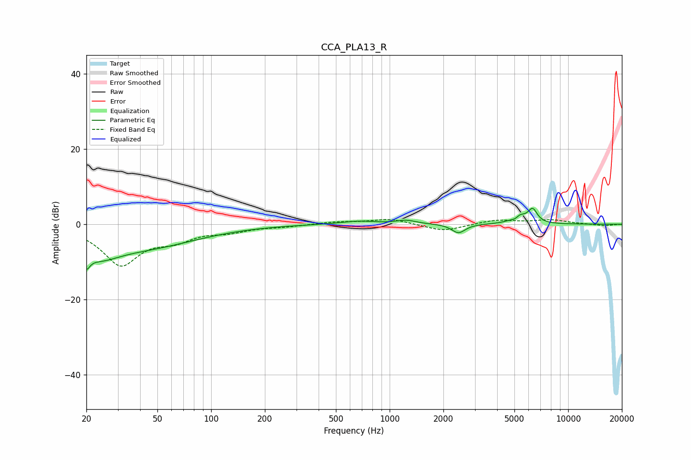

# CCA_PLA13_R
See [usage instructions](https://github.com/jaakkopasanen/AutoEq#usage) for more options and info.

### Parametric EQs
Apply preamp of -4.3 dB when using parametric equalizer.

|   # | Type    |   Fc (Hz) |    Q |   Gain (dB) |
|-----|---------|-----------|------|-------------|
|   1 | Peaking |        20 | 5.01 |        -8.5 |
|   2 | Peaking |        20 | 4.56 |         4.2 |
|   3 | Peaking |        24 | 1.19 |        -5.1 |
|   4 | Peaking |        44 | 0.47 |        -5.5 |
|   5 | Peaking |       668 | 1.43 |         0.9 |
|   6 | Peaking |      1238 | 2.62 |         1   |
|   7 | Peaking |      2429 | 3.79 |        -2.4 |
|   8 | Peaking |      5090 | 5.77 |        -2   |
|   9 | Peaking |      5217 | 3.89 |         3.3 |
|  10 | Peaking |      6327 | 5.3  |         3.6 |

### Fixed Band EQs
When using fixed band (also called graphic) equalizer, apply preamp of **-1.3 dB** (if available) and set gains manually with these parameters.

|   # | Type    |   Fc (Hz) |    Q |   Gain (dB) |
|-----|---------|-----------|------|-------------|
|   1 | Peaking |        31 | 1.41 |       -10.5 |
|   2 | Peaking |        62 | 1.41 |        -3.2 |
|   3 | Peaking |       125 | 1.41 |        -1.6 |
|   4 | Peaking |       250 | 1.41 |        -0.5 |
|   5 | Peaking |       500 | 1.41 |         0.6 |
|   6 | Peaking |      1000 | 1.41 |         1.4 |
|   7 | Peaking |      2000 | 1.41 |        -1.9 |
|   8 | Peaking |      4000 | 1.41 |         1.2 |
|   9 | Peaking |      8000 | 1.41 |         1.1 |
|  10 | Peaking |     16000 | 1.41 |        -0.4 |

### Graphs

