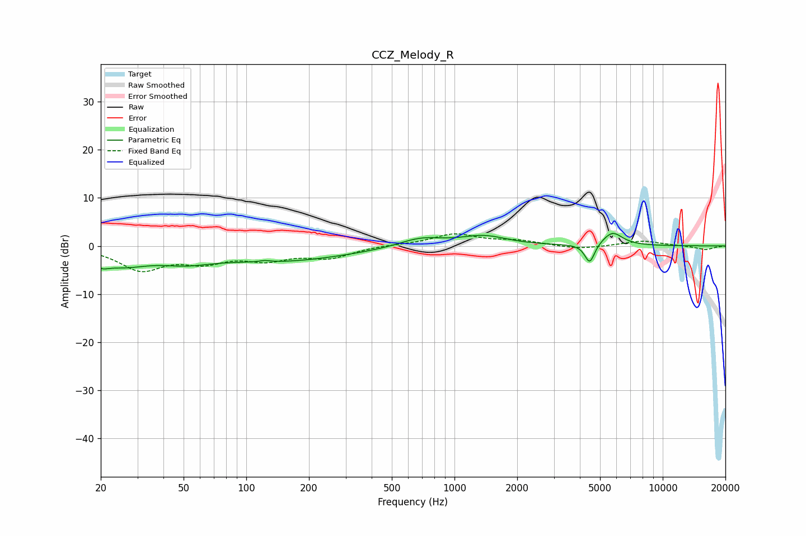

# CCZ_Melody_R
See [usage instructions](https://github.com/jaakkopasanen/AutoEq#usage) for more options and info.

### Parametric EQs
Apply preamp of -2.7 dB when using parametric equalizer.

|   # | Type    |   Fc (Hz) |    Q |   Gain (dB) |
|-----|---------|-----------|------|-------------|
|   1 | Peaking |        20 | 4.17 |        -1.4 |
|   2 | Peaking |        25 | 1.06 |        -3.4 |
|   3 | Peaking |        51 | 1.12 |        -1.9 |
|   4 | Peaking |       123 | 5.52 |         3.1 |
|   5 | Peaking |       123 | 5.51 |        -2.8 |
|   6 | Peaking |       145 | 0.42 |        -3   |
|   7 | Peaking |       690 | 1.35 |         1.8 |
|   8 | Peaking |      1381 | 1.27 |         2   |
|   9 | Peaking |      4459 | 6    |        -4.1 |
|  10 | Peaking |      5734 | 2.85 |         2.9 |

### Fixed Band EQs
When using fixed band (also called graphic) equalizer, apply preamp of **-2.6 dB** (if available) and set gains manually with these parameters.

|   # | Type    |   Fc (Hz) |    Q |   Gain (dB) |
|-----|---------|-----------|------|-------------|
|   1 | Peaking |        31 | 1.41 |        -4.7 |
|   2 | Peaking |        62 | 1.41 |        -2.8 |
|   3 | Peaking |       125 | 1.41 |        -2.4 |
|   4 | Peaking |       250 | 1.41 |        -2.3 |
|   5 | Peaking |       500 | 1.41 |         0.2 |
|   6 | Peaking |      1000 | 1.41 |         2.4 |
|   7 | Peaking |      2000 | 1.41 |         1   |
|   8 | Peaking |      4000 | 1.41 |        -0.7 |
|   9 | Peaking |      8000 | 1.41 |         1.1 |
|  10 | Peaking |     16000 | 1.41 |        -0.8 |

### Graphs

